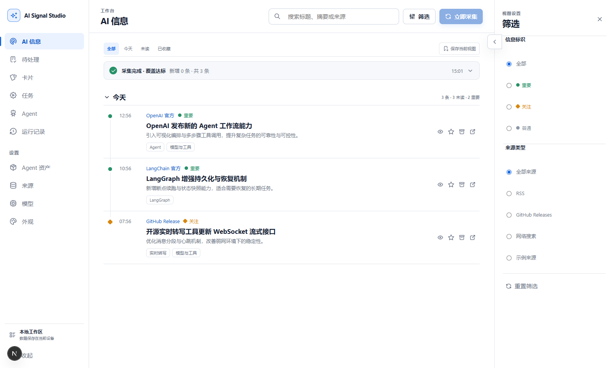
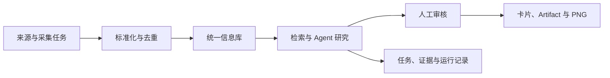
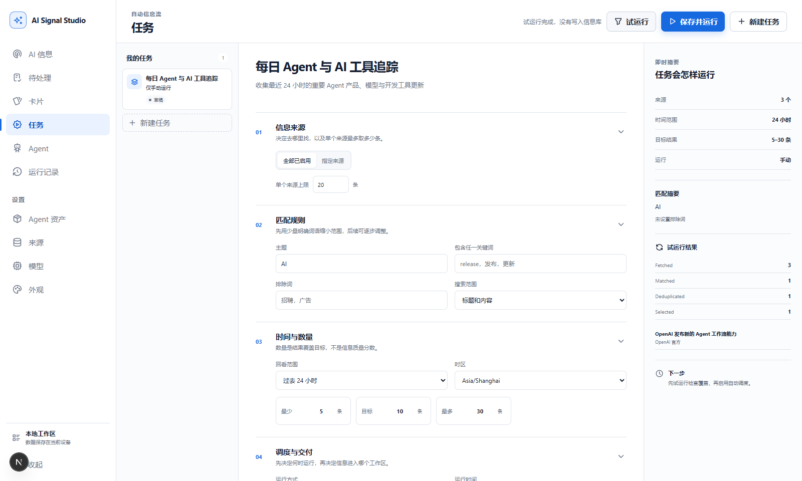
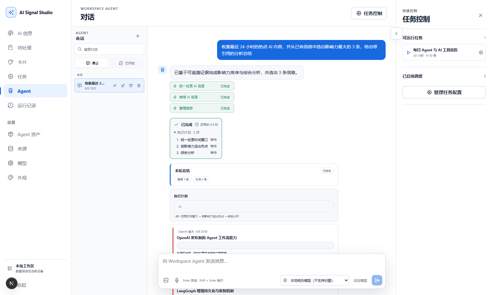
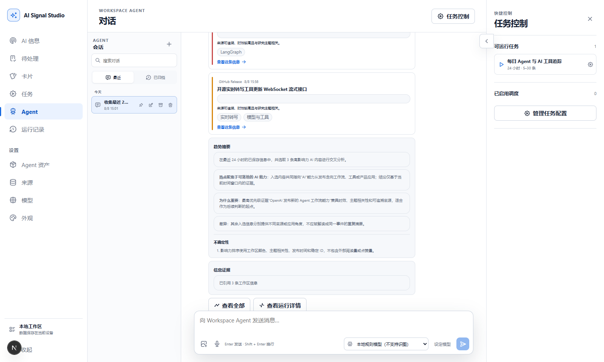
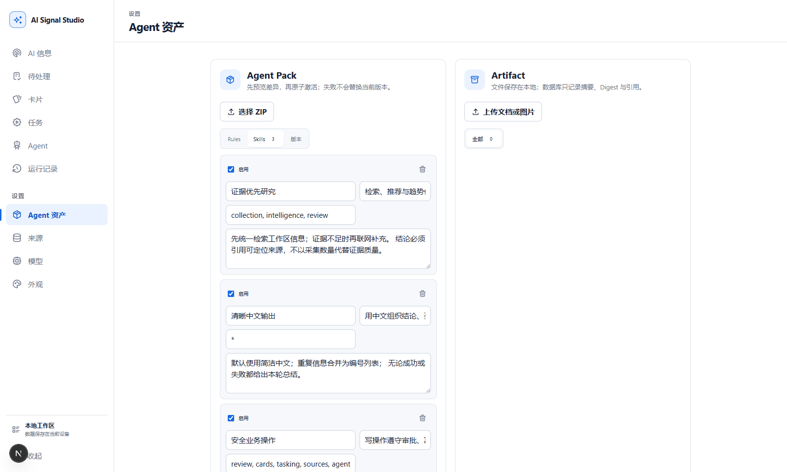
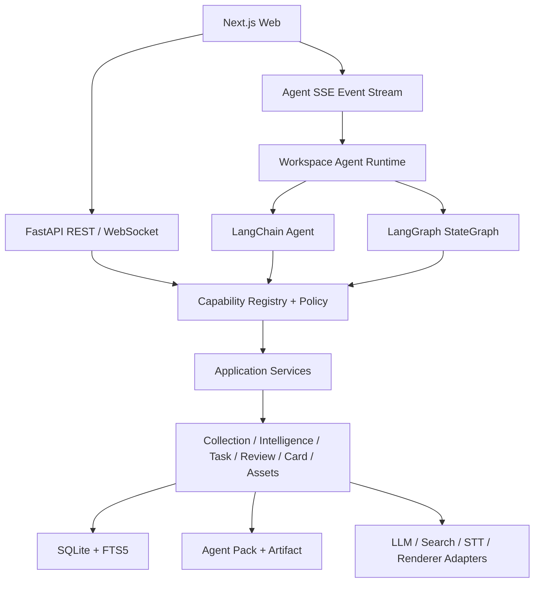

# AI Signal Studio

> 本地优先、可配置、可恢复的 AI 信息与知识工作台。

AI Signal Studio 持续收集 RSS、GitHub Releases 与联网搜索中的最新信息，完成标准化、
去重、检索、分析、审核和内容生成，并将结果沉淀为可追溯的本地信息资产。内置
Workspace Agent 不是独立的聊天壳：它与界面共用同一套业务能力，可以规划并执行采集、
研究、审核和内容加工任务。

当前版本面向 **Windows 单工作区本地部署**，默认可离线启动；配置支持 Tool Calling
的模型后，即可启用完整的自然语言 Agent 工作流。

> [!NOTE]
> 项目处于 `0.1.0` 开发阶段。桌面核心闭环已经可运行；外部 A2A/MCP Agent Gateway、
> 通用工作流编辑器和移动端专项设计仍未交付。完整状态见
> [实现与验收记录](docs/07-delivery/07-04-optimization-implementation-status.md)。

<p align="center">
  <a href="docs/05-platform/assets/readme/app-timeline.png">
    
  </a>
</p>

<p align="center"><sub>真实运行界面：统一 AI 信息时间线、采集状态与组合筛选</sub></p>

## 为什么做这个项目

传统的信息工具负责“展示内容”，通用 Agent 负责“回答问题”，两者之间通常缺少稳定的
执行、证据和知识沉淀链路。AI Signal Studio 将这些环节放进一个可恢复的本地工作区：

| 传统实现 | AI Signal Studio 的做法 |
| --- | --- |
| 搜索、收藏、分析和写作散落在不同工具 | 统一为“采集 → 信息库 → 研究 → 审核 → 内容产物”闭环 |
| 前端、Agent 和 API 分别实现业务规则 | 通过 Capability Core 共用同一套 Application Service |
| 用关键词分支模拟 Agent，一次只能处理单一动作 | 使用真实 LangChain Agent + LangGraph `StateGraph` 执行多步骤计划 |
| 长任务刷新后丢失，单步失败导致整体失败 | 持久化 Turn、Event 与 Checkpoint，支持续传、恢复、取消和局部完成 |
| 将全部历史和知识直接塞入 Prompt | 按任务动态选择 Domain、Rules、Skills、工具和历史证据 |
| 模型生成的结论缺少可验证引用 | 研究结果绑定真实 `information_id`、来源和站内路径 |
| 每次查询都调用外部搜索 | 本地检索满足目标时零网络调用，证据不足时才联网补充 |

## 能做什么



### 收集最新信息

- 配置 RSS/Atom、GitHub Releases 和搜索来源；
- 手动采集、试运行或按计划定时执行；
- 通过 canonical URL、稳定 ID 和内容特征去重；
- 记录任务版本、来源版本、筛选漏斗、执行状态与覆盖状态。

<p align="center">
  <a href="docs/05-platform/assets/readme/app-task-workbench.png">
    
  </a>
</p>

<p align="center"><sub>版本化采集任务：在正式执行前验证来源、匹配规则与筛选漏斗</sub></p>

### 把信息变成可检索资产

- 按日期浏览统一信息时间线；
- 搜索、筛选、已读、收藏、归档、笔记和保存视图；
- 使用 SQLite FTS5 BM25、短词匹配、RRF 融合和 SimHash 近重复分组；
- 统一检索待处理、信息库、归档和卡片阶段，避免同一内容被重复加工。

### 让 Agent 完成真实工作

- 将自然语言目标转换为结构化 Goal 与 Plan；
- 按步骤动态加载 Domain Prompt、Agent Pack、Skill 和 Capability Tool；
- 支持并行步骤、人工审批、失败继续、最多两次有界 Replan；
- 通过 SSE 输出计划、进度、证据、部分失败和结构化结果；
- 对候选不足或证据缺失返回明确的 `partial`，不虚构来源和结论。

<p align="center">
  <a href="docs/05-platform/assets/readme/app-agent-plan.png">
    
  </a>
  <a href="docs/05-platform/assets/readme/app-agent-result.png">
    
  </a>
</p>

<p align="center"><sub>左：可展开的执行计划与步骤状态 —— 右：绑定站内证据的推荐和趋势总结</sub></p>

### 定义自己的 Agent 工作方式

Agent Pack 使用 Markdown、YAML 和 JSONL 保存可编辑、可版本化的：

- 身份与行为；
- Workspace Rules；
- 可启用 Skills；
- 能力、来源与评分策略；
- 知识、偏好、事实、决策和观察记忆；
- 卡片样式与输出示例。

Agent Pack 文件是事实来源，数据库只保存版本、引用和索引状态。运行时按需加载相关内容，
不会无条件把整个知识目录发送给模型。

<p align="center">
  <a href="docs/05-platform/assets/readme/app-agent-assets.png">
    
  </a>
</p>

<p align="center"><sub>Agent Pack 资产：用可版本化文件定义身份、规则、Skills、知识与长期记忆</sub></p>

### 审核并生成内容产物

- 批量保留、拒绝、延后或编辑信息；
- 从已确认信息生成可编辑卡片；
- 经过审批后使用 HTML/CSS + Playwright 离线渲染 1200×1500 PNG；
- 管理文档、图片和生成内容 Artifact；
- 使用浏览器麦克风和 WebSocket 将实时语音转成可编辑文字。

## 快速开始

### 环境要求

- Windows 11；
- Python `3.12`；
- Node.js `>=20.19 <25`；
- Git。

项目锁定 pnpm `11.9.x`，初始化脚本会优先复用可用版本，或通过 Corepack/npx 准备
项目内工具。

### 安装并启动

```powershell
git clone https://github.com/WNIK7750/ai-signal-studio.git
cd ai-signal-studio

# 首次安装；也可以直接双击 setup.cmd
.\scripts\bootstrap.ps1

# 启动 API 与 Web；也可以直接双击 start.cmd
.\start.ps1
```

应用准备完成后会打开 [http://127.0.0.1:3000](http://127.0.0.1:3000)。按 `Ctrl+C`
可以同时停止前后端。

首次启动会：

1. 创建本地 SQLite 数据库；
2. 准备 OpenAI 官方 RSS、LangGraph Releases 和 Transformers Releases 三个真实来源；
3. 使用无需 API Key 的离线 `heuristic` Provider；
4. 将对话、任务、信息、Checkpoint 和 Artifact 保存在本机。

即使没有配置模型，来源、采集、时间线、筛选、任务、审核、卡片和确定性研究仍然可用。

### 配置模型

1. 启动应用并打开 `/settings/models`；
2. 选择 Provider 预设；
3. 填写 API Key、模型 ID 和模型能力；
4. 保存后执行连接测试；
5. 在 Workspace Agent 会话中选择模型。

模型元数据保存在 `config/models.local.json`，密钥保存在
`config/model-secrets.local.json`。两个文件均被 Git 忽略，API 不返回密钥原文。

联网补证可使用模型原生 `web_search`；未配置搜索模型时，可以在根目录 `.env` 中设置
`AI_SIGNAL_SEARCH_API_KEY`，使用 Brave Search Adapter 作为后备。

### 尝试一个完整任务

在 Workspace Agent 中输入：

```text
收集最近 24 小时的热点 AI 内容，选出影响力最大的 3 条，给出分析总结并保留引用。
```

Agent 会根据本地证据和配置生成计划，必要时依次执行采集、统一检索、推荐和趋势总结，
并在界面中显示步骤状态、信息引用、证据边界和运行详情。

## 工作原理



### 统一能力内核

仓库当前定义了 37 项机器可读 Capability 契约。Web、Workspace Agent、调度器和未来的
协议 Adapter 都只能通过 Capability/Application Service 执行业务动作；Router、Tool
和 Graph Node 不复制业务规则。

### 可恢复 Agent Runtime

LangChain 负责模型调用、动态 Prompt/Tool、结构化输出和 Agent Loop；LangGraph 负责
计划编排、并行、Checkpoint、流式事件、审批暂停、恢复、重试和结果合并。当前
Workspace Agent 工作流版本为 `0.8.0`，机器规格见
[Agent Task Graph](graph-specs/02-module-review-agent/02-agent-task-graph.yaml)。

### 模块化单体

项目保持单机可运行的模块化单体，通过 Pydantic Schema、Python Protocol、Capability、
Repository 和 Adapter 管理边界。只有跨步骤长流程进入 LangGraph，普通 CRUD 继续由
Application Service 处理；在出现真实部署压力前不拆分微服务。

## 技术栈

| 层级 | 技术 |
| --- | --- |
| Web | Next.js 16、React 19、TypeScript、TanStack Query、Tabler Icons |
| API | Python 3.12、FastAPI、Pydantic、SQLAlchemy |
| Agent | LangChain、LangGraph、SQLite Checkpointer |
| 数据 | SQLite、本地文件存储、FTS5 |
| 调度 | APScheduler |
| 内容渲染 | HTML/CSS、Playwright |
| 语音 | WebSocket、WhisperLive Adapter |
| 质量 | pytest、Vitest、Playwright、ESLint、JSON Schema、Gitleaks |

## 当前质量基线

最新确定性验收记录：

- 后端：`165 passed`，专用真实模型用例默认排除；
- 契约：`3 passed`；
- 前端单元测试：`13 passed`；
- Playwright：`13/13 passed`；
- ESLint 与 Next.js 生产构建通过；
- Release Safety 的 worktree、tracked、history 检查通过；
- 专用真实模型链路已使用 `qwen3.7-plus` 完成验收。

真实模型不会混入普通 pytest、Vitest 或 Playwright。日常测试使用 Fake、Fixture 或 Mock；
只有核心功能的确定性回归全部通过后，才通过专用命令显式开启完整链路验收。

```powershell
# 后端、契约、前端单元测试、代码检查和生产构建
.\scripts\verify.ps1

# 在上述检查之外运行桌面端 Playwright 流程
.\scripts\verify.ps1 -E2E

# 仅运行 Agent Runtime 模块测试
.\.venv\Scripts\python.exe -m pytest tests/modules/agent_runtime -q
```

## 本地数据与安全

以下内容仅属于当前设备，并由 Git 忽略和发布 Guard 保护：

```text
.env
config/models.local.json
config/model-secrets.local.json
data/
logs/
exports/
backups/
agent-packs/local/
```

- 上传文件经过扩展名、MIME、Magic Bytes、大小和 Digest 校验；
- 网页抓取会检查公网地址、DNS、重定向、凭据 URL、MIME 和响应大小；
- 外部网页、Agent Pack 和未来 MCP Resource 都被视为不可信内容；
- Agent 消息与 Graph State 只保存 Artifact ID，不保存图片二进制或完整大文档；
- 默认不保存原始麦克风音频；
- 删除默认使用软删除或状态变更，高风险动作按策略要求审批。

备份前停止应用，然后复制 `.env`、`config/*.local.json` 和 `data/` 到受保护位置。除非
用户配置并触发模型、搜索、GitHub 或转写 Provider，仓库不会主动向外部服务发送本地
数据；密钥、本地数据库、完整 Agent Pack、日志和 Artifact 文件不会作为普通业务数据
上传。

## 项目状态与路线图

### 已形成桌面闭环

- 版本化采集任务、试运行和定时调度；
- 多来源采集、统一检索和按需联网补证；
- 信息时间线、保存视图和本地状态；
- 多会话 Workspace Agent、可恢复执行和结构化结果；
- Agent Pack、Rules、Skills、Artifact 和实时转写；
- 批量审核、卡片编辑、审批和 PNG 渲染；
- 模型配置、搜索模型、主题与运行记录。

### 继续建设

- 运行详情中的逐来源耗时、重试和差异比较；
- 任务版本历史与恢复界面；
- 来源分组、批量测试、限速与凭据状态；
- 专题板、周报和可导出知识交付物；
- 更完整的 Review Graph 审批恢复；
- 桌面验收完成后的移动端专项设计。

### 明确延后

- 可运行的外部 MCP/A2A Agent Gateway；
- 通用拖拽工作流平台；
- 插件市场和多租户 SaaS；
- 微服务、分布式队列和通用多 Agent 平台。

外部 Agent Gateway 的设计已经完成，但在外部身份、Scope、审批和审计边界稳定前不会
开放运行端口或写能力。详见
[外部 Agent Gateway 设计](docs/04-module-poster-interop/04-02-external-agent-gateway-design.md)。

## 文档导航

| 内容 | 入口 |
| --- | --- |
| 完整文档索引 | [docs/README.md](docs/README.md) |
| 产品目标与非目标 | [项目章程](docs/00-project/00-01-project-charter.md) |
| 用户流程 | [产品范围与用户流程](docs/00-project/00-02-product-and-user-flows.md) |
| 系统架构 | [系统架构](docs/00-project/00-03-system-architecture.md) |
| Capability 契约 | [Capability Contract](docs/05-platform/05-01-capability-contract.md) |
| Agent 上下文与工作流 | [Context Engineering](docs/02-module-review-agent/02-03-agent-context-engineering-and-workflows.md) |
| Agent 工程蓝图 | [Final Agent Engineering Blueprint](docs/02-module-review-agent/02-05-final-agent-engineering-blueprint.md) |
| 测试策略 | [Simple TDD](docs/06-quality-operations/06-01-simple-tdd-and-testing.md) |
| 安全与审批 | [Security and Approval](docs/06-quality-operations/06-03-security-and-approval.md) |
| 当前实现状态 | [Optimization Implementation Status](docs/07-delivery/07-04-optimization-implementation-status.md) |

按模块阅读：

| 模块 | 内容 |
| --- | --- |
| 01 | [AI 信息与采集](docs/01-module-timeline/01-00-overview.md) |
| 02 | [审核工作台与 Workspace Agent](docs/02-module-review-agent/02-00-overview.md) |
| 03 | [Agent Pack、Artifact 与实时转写](docs/03-module-agent-assets-stt/03-00-overview.md) |
| 04 | [信息卡片与外部接口设计](docs/04-module-poster-interop/04-00-overview.md) |

## 仓库结构

```text
.
├── apps/web/              # Next.js 产品界面
├── apps/api/              # FastAPI 组合根、Router 与业务模块
├── agent-packs/           # 可版本化 Agent Pack 示例
├── contracts/             # Capability、模型、设计系统等机器契约
├── docs/                  # 产品、模块、平台、质量与交付文档
├── graph-specs/           # LangGraph 机器规格
├── prompts/               # 模块实施提示词
├── scripts/               # 安装、启动、验证和发布安全脚本
├── tests/                 # 后端、契约、Graph、评测与完整链路测试
└── vendor_tools/          # 第三方工具与业务 Adapter 隔离区
```

## 参与开发

开始修改前，请先阅读 [AGENTS.md](AGENTS.md) 和对应模块的 `XX-00-overview.md`：

1. 运行现有测试基线；
2. 为一个完整用户行为增加 2～6 个关键测试；
3. 先完成 Application Capability，再接入 REST、Agent Tool 和界面；
4. 修改 Schema 时同步更新契约、示例和测试；
5. 修改 Workspace Agent 工作流时，同步 Graph Spec、历史图、实现状态、Figma 和测试。

问题与建议可以通过 [GitHub Issues](https://github.com/WNIK7750/ai-signal-studio/issues) 提交。

## 授权计划

项目计划采用“**源码公开、允许学习与非商业使用、商业使用需另行授权**”的方式发布。
这类许可严格来说属于 source-available，而不是 OSI 定义下允许任何商业用途的 Open
Source。

当前仓库尚未提交正式 `LICENSE`，因此上述计划尚未构成许可授权。在许可证落地前，
默认保留全部权利。候选方案为面向软件设计的
[PolyForm Noncommercial 1.0.0](https://polyformproject.org/licenses/noncommercial/1.0.0/)；
最终采用前还需要确认商业授权方式、版权声明以及第三方依赖和素材的许可证兼容性。
