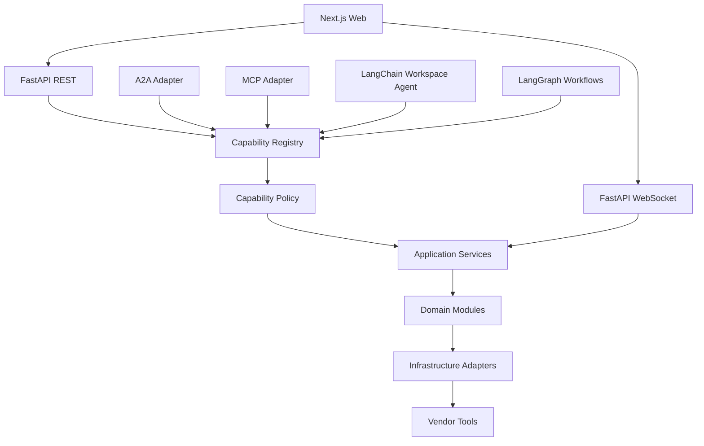

# 00-03 系统架构

## 1. 架构风格

- 前后端分离；
- 后端模块化单体；
- 端口与契约驱动；
- 统一 Capability Core；
- LangGraph 只处理跨步骤长流程；
- 第三方工具隔离在 `vendor_tools/`。

## 2. 总体视图



## 3. 推荐仓库结构

```text
apps/
├── api/                         # FastAPI composition root 与传输层
└── web/                         # Next.js

packages/
├── domain/                      # 实体、值对象、领域规则
├── application/                 # 用例、Capability、事务边界
├── agent_runtime/               # LangChain Agent 与 Tool adapter
├── orchestration/               # LangGraph 图与状态
├── adapters/                    # DB、搜索、LLM、STT、渲染等适配
├── contracts/                   # Pydantic 输入输出模型
└── shared/                      # 少量跨模块基础设施

agent-packs/                     # 文档化 Agent 客制化
capability-manifests/            # 能力声明
vendor_tools/                    # 第三方集成隔离区
tests/
docs/
```

## 4. 依赖方向

```text
Transport/UI
    ↓
Application / Capability
    ↓
Domain

Adapters ──实现──> Application/Domain 定义的 Protocol
Agent Runtime ──调用──> Capability Executor
LangGraph ──编排──> Capability Executor
```

禁止：

- Domain 导入 FastAPI、LangChain、LangGraph 或 SQLAlchemy ORM；
- Capability 导入 Next.js 概念；
- Tool 直接调用 Repository；
- Graph Node 直接拼 SQL；
- Vendor 工具反向成为业务事实来源。

## 5. Composition Root

所有实现的装配集中在 API 应用启动层：

```python
build_settings()
build_database()
build_repositories()
build_adapters()
build_application_services()
build_capability_registry()
build_graphs()
build_agent_runtime()
build_api()
```

显式装配优先于隐式包扫描，方便代码 Agent 搜索依赖链。

## 6. 同步与异步

- 简单查询、编辑：普通 REST 请求；
- 长时间采集/分析/卡片批量生成：创建 Run，异步执行 Graph；
- 运行进度：SSE 或轮询；
- 实时语音：WebSocket；
- 第一版可使用进程内任务执行器，避免立刻引入 Celery/Redis。

## 7. 可替换点

必须由 Protocol/Adapter 隔离：

- LLM Provider；
- Search Provider；
- Feed Collector；
- Article Extractor；
- Embedding/Index；
- Document Parser；
- Image Analyzer；
- Realtime STT Provider；
- Artifact Storage；
- Poster Renderer；
- Trace Sink。
