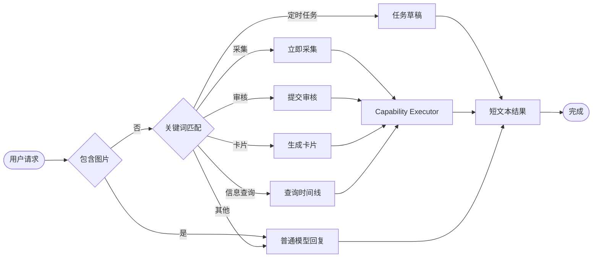

# 02-04 Agent 工作流历史图谱

## 用途

本文是 AI Signal Studio Agent 工作流的仓库内长期事实来源。它保留已经实现和已经接受
的目标设计，帮助后续对话、开发 Agent 和代码审阅者理解工作流为什么变化。

维护规则：

- 只追加新版本，不删除或改写旧版本；
- 每个版本记录状态、日期、变化原因、Mermaid 节点图、设计文档和任务批次；
- Figma 保存当前可编辑视图，Markdown 保留全部历史；
- 代码、Graph Spec、Figma 与本文使用相同 `workflow_version`；
- 修改节点、边、Domain、审批、重规划或结果汇总时，必须在同一批次更新本文和任务
  列表；
- 图中只表示可执行计划和系统状态，不表示或保存模型隐藏思维链。

## 版本索引

| 版本 | 日期 | 状态 | 摘要 | Figma |
|---|---|---|---|---|
| `0.1.0` | 2026-08-05 | 当前已实现基线 | 关键词路由到单一 Capability 或普通模型回复 | 无 |
| `0.2.0` | 2026-08-05 | 已接受的中间设计 | Plan、Capability Gate、Tool/Workflow Router、Reflection 与人工审批 | 用户提供的参考图 |
| `0.3.0` | 2026-08-05 | 已被 0.4.0 替代 | LangChain + LangGraph、Base + Domain 动态上下文、Tool Broker、结构化 Planner、部分成功与可恢复执行 | [同一 FigJam 中的历史图](https://www.figma.com/board/dF7TcDtCd3J96E0Bb0F5Ad) |
| `0.4.0` | 2026-08-05 | 当前最终指导蓝图 | Context + Harness、Fast/LLM Plan、动作绑定后审批、DAG 调度与汇合、Evidence、评测和适配性审查 | [打开可编辑 FigJam](https://www.figma.com/board/dF7TcDtCd3J96E0Bb0F5Ad) |

---

## 0.1.0：关键词快捷动作

**状态：** 当前代码实现基线。
**事实入口：** `apps/api/src/ai_signal_api/agent_runtime/service.py`。
**限制：** 互斥关键词分支；一次通常只执行一个动作；Domain Prompt 和 Tool Schema
没有进入模型调用。



**被替换原因：**

- 无法组合多个站内能力；
- 多请求会被第一个互斥分支截断；
- 工具集合、系统约束和模块说明没有动态进入模型；
- 没有 Plan、步骤状态、耗时、审批、重规划和部分结果。

---

## 0.2.0：Plan & Execute 中间设计

**状态：** 已接受的概念设计，尚未完整实现。
**来源：** 用户提供的 Workspace Agent Plan & Execute 节点图，以及
`05-02-langgraph-workflows.md` 的 `agent_task_graph` 方向。


**保留的设计：**

- Planner 与执行分离；
- Capability Gate；
- 原子 Tool 和 Domain Subgraph 两种执行方式；
- 人工审批、结果合并和重规划。

**需要继续改进：**

- “上下文装配”没有区分 Base、Domain、Task 和 Evidence；
- Executor 如果永久获得全站工具会导致上下文膨胀和选错工具；
- Reflection 范围和循环预算不明确；
- 模块对工具说明和调用接口的所有权不明确。

---

## 0.3.0：上下文工程与动态 Domain

**状态（发布时）：** 当时的当前目标设计，等待 E7～E11 实现。
**设计文档：**
[02-03 Workspace Agent 上下文工程与动态工作流](02-03-agent-context-engineering-and-workflows.md)。
**任务入口：**
[07-04 全面优化实现状态](../07-delivery/07-04-optimization-implementation-status.md)。


**相对 0.2.0 的变化：**

- 明确生产运行时使用 LangChain Agent 与 LangGraph StateGraph，不自研 Agent Loop；
- Base Prompt 成为独立、版本化、每次调用必有的系统层；
- Bootstrap Context 只包含 Base、Agent Pack 和轻量 Domain Index；
- 每个步骤才加载对应 Domain Prompt 和工具；
- Clarification Gate 与 Approval Gate 分离；
- 增加 Plan Validator，模型不能发明 Domain、能力和审批；
- Tool Broker 只暴露当前步骤需要的工具；
- Inspector 只做结构化 Continue/Replan 判断；
- 明确部分完成、预算耗尽和等待状态；
- Domain Pack 与业务模块共同维护，Agent Runtime 不复制业务规则。

**可用性目标：**

- LangGraph SQLite Checkpointer 支持本地部署重启恢复；
- stream 事件投影为有序 SSE，断线可续传；
- 并行步骤完成结果写入 checkpoint，恢复时不重复成功步骤；
- 外部副作用使用幂等键；
- 多实例只预留 PostgreSQL Checkpointer，不拆微服务。

**Figma 当前图：**
[AI Signal Studio Agent 工作流 v0.3.0](https://www.figma.com/board/dF7TcDtCd3J96E0Bb0F5Ad?utm_source=other&utm_content=edit_in_figjam&oai_id=v1%2FCDDM3t6vDYtLHmNVmAhyDhZ6Sm28NkLJCbdLyg0d8pw9LYnwct0Iyp&request_id=79c23b62-e43c-43b0-9299-1c48e45bd35b)。

图中的 `N21` 仅投影等待状态；`N07` 和 `N10` 才是 LangGraph
`interrupt()` 暂停点，恢复后沿原 checkpoint 继续。

---

## 0.4.0：适配项目体量的 Context + Harness 最终指导蓝图

**状态：** 当前目标蓝图，运行时代码尚未实现。
**变化原因：** 0.3.0 没有清晰表达运行 Harness、DAG 调度、动作参数绑定、Evidence
记录、统一终态和评测闭环；审批发生在参数绑定之前，无法安全绑定真实
`input_digest`。
**设计文档：**
[02-05 Workspace Agent 最终工程蓝图](02-05-final-agent-engineering-blueprint.md)。
**上下文与工作流细节：**
[02-03 Workspace Agent 上下文工程与动态工作流](02-03-agent-context-engineering-and-workflows.md)。
**任务入口：**
[07-04 全面优化实现状态](../07-delivery/07-04-optimization-implementation-status.md)。
**Graph Spec：**
[Agent Task Graph 0.4.0](../../graph-specs/02-module-review-agent/02-agent-task-graph.yaml)。
**Figma：**
[AI Signal Studio Agent 工作流 0.4.0](https://www.figma.com/board/dF7TcDtCd3J96E0Bb0F5Ad)。


**相对 0.3.0 的变化：**

- 增加 Product Turn Harness：版本清单、租约、预算、取消、Journal、恢复扫描和 Finalizer；
- 增加 Direct/Fast/LLM 三种统一 Plan 模式，不再让简单请求承担无必要 Planner 成本；
- 增加 Ready Step Scheduler 与 Result Join，实际表达 DAG、`Send`、fan-out/fan-in；
- Step Context 与 Tool Resolver 在步骤级按需装配；
- 增加 Action Binder 与 Action Validator；审批发生在参数和摘要可验证之后；
- 执行器区分原子 Capability、有预算的 Domain Agent 和已知 Domain Subgraph；
- Evidence/Artifact 先持久化，再进行 Outcome Inspector；
- Inspector 先运行确定性 Acceptance Policy，语义 Judge 只按需启用；
- 所有终态经同一个 Finalizer 写入；
- Graph `thread_id=turn_id`，业务 Run 只作为 State 引用；
- 增加独立 Evaluation Harness 与 Blueprint Change Proposal 机制；
- 明确 LangSmith、OpenTelemetry、PostgreSQL 和多 Agent 均不是本地首版必需项。

**适配性结论：**

0.4.0 保持单 Workspace Agent、FastAPI 单进程、SQLite Checkpointer 和模块 Capability
边界。它吸收 Context/Harness Engineering 的可靠性做法，但没有引入通用 Agent
平台、分布式队列、插件市场或自治多 Agent 团队。

---

## 新版本追加模板

复制以下模板到文末，不覆盖旧版本：

```text
## x.y.z：版本名称

状态：
日期：
实现或目标：
变化原因：
设计文档：
任务批次：
Graph Spec：
Figma：

Mermaid 节点图

相对上一版本：
- 新增
- 删除
- 行为变化

验证：
- 契约
- 单元测试
- Graph 测试
- Playwright
```

## 0.4.0 实现同步：完整产品 Domain 与发布评测

状态：当前生产实现同步
日期：2026-08-06
实现或目标：保持 N01～N25 拓扑，完成 Schema 驱动 Tool 装配、产品 Domain 路由、
发布级 Context/Evidence 预算与确定性 Evaluation Harness。
变化原因：产品收尾需要让来源、任务、运行、审核、卡片、Agent Pack、模型、会话与
外观复用同一 CapabilityExecutor，同时不引入第二套 Runtime。
Graph Spec：[Agent Task Graph 0.4.0](../../graph-specs/02-module-review-agent/02-agent-task-graph.yaml)
Figma：[当前 0.4.0 图与 Release Sync 区](https://www.figma.com/board/dF7TcDtCd3J96E0Bb0F5Ad)

本同步没有改变工作流边或节点，因此不升级 `workflow_version`。Figma 节点
`3:304` 记录以下实现事实：

- Domain Pack：`collection`、`intelligence`、`tasking`、`sources`、`runs`、
  `review`、`cards`、`agent_assets`、`models`、`agent`；
- 每步最多选择 3 个 Domain，并向模型暴露最多 8 个 Tool；
- 禁用 Capability 不进入 Tool 列表，伪造调用仍由 Capability Gate 拒绝；
- 外部 Evidence 保持不可信，只装配有界摘要和业务对象引用；
- 模型配置只返回脱敏状态，外观只返回受控客户端 Action。

验证：

- `tests/evals/agent/test_release_eval_harness.py`：3 passed；
- `tests/modules/agent_runtime/test_context.py`：通过；
- Figma Release Sync 区截图核验无裁切、无重叠；
- Graph Spec、历史和 Figma 均保持 `workflow_version=0.4.0`。
