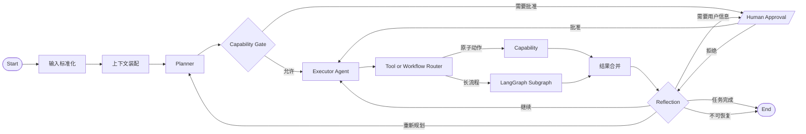
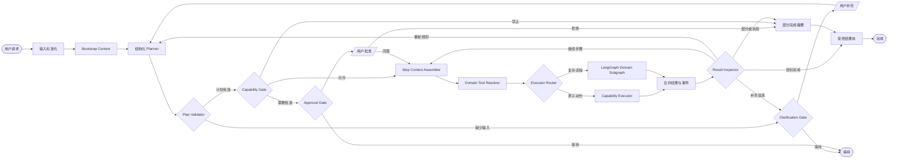
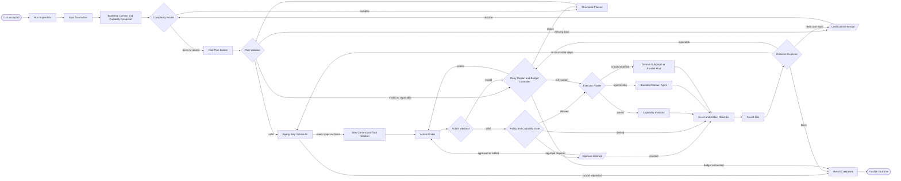
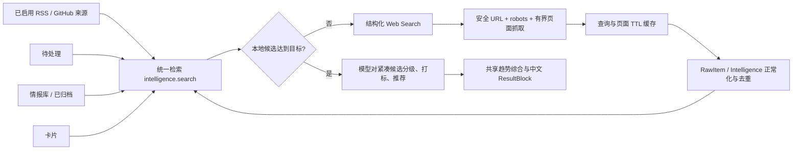

# 02-04 Agent 工作流历史图谱

## 用途

本文是 AI Signal Studio Agent 工作流的仓库内长期事实来源。它保留已经实现和已经接受
的目标设计，帮助后续对话、开发 Agent 和代码审阅者理解工作流为什么变化。

维护规则：

- 只追加新版本，不删除或改写旧版本；
- 每个版本记录状态、日期、变化原因、Mermaid 节点图、设计文档和任务批次；
- Figma 保存当前可编辑视图，Markdown 保留全部历史；
- 代码、Graph Spec、Figma 与本文使用相同 `workflow_version`；
- 修改节点、边、Domain、审批、重规划或结果汇总时，必须在同一批次更新本文和任务
  列表；
- 图中只表示可执行计划和系统状态，不表示或保存模型隐藏思维链。

## 版本索引

| 版本 | 日期 | 状态 | 摘要 | Figma |
|---|---|---|---|---|
| `0.1.0` | 2026-08-05 | 当前已实现基线 | 关键词路由到单一 Capability 或普通模型回复 | 无 |
| `0.2.0` | 2026-08-05 | 已接受的中间设计 | Plan、Capability Gate、Tool/Workflow Router、Reflection 与人工审批 | 用户提供的参考图 |
| `0.3.0` | 2026-08-05 | 已被 0.4.0 替代 | LangChain + LangGraph、Base + Domain 动态上下文、Tool Broker、结构化 Planner、部分成功与可恢复执行 | [同一 FigJam 中的历史图](https://www.figma.com/board/dF7TcDtCd3J96E0Bb0F5Ad) |
| `0.4.0` | 2026-08-05 | 已被 0.5.0 替代 | Context + Harness、Fast/LLM Plan、动作绑定后审批、DAG 调度与汇合、Evidence、评测和适配性审查 | [打开可编辑 FigJam](https://www.figma.com/board/dF7TcDtCd3J96E0Bb0F5Ad) |
| `0.5.0` | 2026-08-06 | 已被 0.6.0 替代 | 单一 Turn Runtime、Goal Coverage、会话窗口、精确时间窗、可验证推荐与综合分析、完整 ResultBlock SSE | [打开可编辑 FigJam](https://www.figma.com/board/dF7TcDtCd3J96E0Bb0F5Ad) |
| `0.6.0` | 2026-08-06 | 已被 0.7.0 替代 | 工具可选规划、所选模型语境推理、条目级有界会话结果、按变更/故障检测模型连接 | [打开可编辑 FigJam](https://www.figma.com/board/dF7TcDtCd3J96E0Bb0F5Ad) |
| `0.7.0` | 2026-08-07 | 当前实现，全部同步 | 跨阶段统一检索、近重复合并、抓取缓存、按需联网补证、模型分级打标与跨 Provider 计划规范化 | [同一 FigJam，0.7.0 当前图与 Release Sync 区](https://www.figma.com/board/dF7TcDtCd3J96E0Bb0F5Ad) |

---

## 0.1.0：关键词快捷动作

**状态：** 当前代码实现基线。
**事实入口：** `apps/api/src/ai_signal_api/agent_runtime/service.py`。
**限制：** 互斥关键词分支；一次通常只执行一个动作；Domain Prompt 和 Tool Schema
没有进入模型调用。


**被替换原因：**

- 无法组合多个站内能力；
- 多请求会被第一个互斥分支截断；
- 工具集合、系统约束和模块说明没有动态进入模型；
- 没有 Plan、步骤状态、耗时、审批、重规划和部分结果。

---

## 0.2.0：Plan & Execute 中间设计

**状态：** 已接受的概念设计，尚未完整实现。
**来源：** 用户提供的 Workspace Agent Plan & Execute 节点图，以及
`05-02-langgraph-workflows.md` 的 `agent_task_graph` 方向。



**保留的设计：**

- Planner 与执行分离；
- Capability Gate；
- 原子 Tool 和 Domain Subgraph 两种执行方式；
- 人工审批、结果合并和重规划。

**需要继续改进：**

- “上下文装配”没有区分 Base、Domain、Task 和 Evidence；
- Executor 如果永久获得全站工具会导致上下文膨胀和选错工具；
- Reflection 范围和循环预算不明确；
- 模块对工具说明和调用接口的所有权不明确。

---

## 0.3.0：上下文工程与动态 Domain

**状态（发布时）：** 当时的当前目标设计，等待 E7～E11 实现。
**设计文档：**
[02-03 Workspace Agent 上下文工程与动态工作流](02-03-agent-context-engineering-and-workflows.md)。
**任务入口：**
[07-04 全面优化实现状态](../07-delivery/07-04-optimization-implementation-status.md)。



**相对 0.2.0 的变化：**

- 明确生产运行时使用 LangChain Agent 与 LangGraph StateGraph，不自研 Agent Loop；
- Base Prompt 成为独立、版本化、每次调用必有的系统层；
- Bootstrap Context 只包含 Base、Agent Pack 和轻量 Domain Index；
- 每个步骤才加载对应 Domain Prompt 和工具；
- Clarification Gate 与 Approval Gate 分离；
- 增加 Plan Validator，模型不能发明 Domain、能力和审批；
- Tool Broker 只暴露当前步骤需要的工具；
- Inspector 只做结构化 Continue/Replan 判断；
- 明确部分完成、预算耗尽和等待状态；
- Domain Pack 与业务模块共同维护，Agent Runtime 不复制业务规则。

**可用性目标：**

- LangGraph SQLite Checkpointer 支持本地部署重启恢复；
- stream 事件投影为有序 SSE，断线可续传；
- 并行步骤完成结果写入 checkpoint，恢复时不重复成功步骤；
- 外部副作用使用幂等键；
- 多实例只预留 PostgreSQL Checkpointer，不拆微服务。

**Figma 当前图：**
[AI Signal Studio Agent 工作流 v0.3.0](https://www.figma.com/board/dF7TcDtCd3J96E0Bb0F5Ad?utm_source=other&utm_content=edit_in_figjam&oai_id=v1%2FCDDM3t6vDYtLHmNVmAhyDhZ6Sm28NkLJCbdLyg0d8pw9LYnwct0Iyp&request_id=79c23b62-e43c-43b0-9299-1c48e45bd35b)。

图中的 `N21` 仅投影等待状态；`N07` 和 `N10` 才是 LangGraph
`interrupt()` 暂停点，恢复后沿原 checkpoint 继续。

---

## 0.4.0：适配项目体量的 Context + Harness 最终指导蓝图

**状态：** 当前目标蓝图，运行时代码尚未实现。
**变化原因：** 0.3.0 没有清晰表达运行 Harness、DAG 调度、动作参数绑定、Evidence
记录、统一终态和评测闭环；审批发生在参数绑定之前，无法安全绑定真实
`input_digest`。
**设计文档：**
[02-05 Workspace Agent 最终工程蓝图](02-05-final-agent-engineering-blueprint.md)。
**上下文与工作流细节：**
[02-03 Workspace Agent 上下文工程与动态工作流](02-03-agent-context-engineering-and-workflows.md)。
**任务入口：**
[07-04 全面优化实现状态](../07-delivery/07-04-optimization-implementation-status.md)。
**Graph Spec：**
[Agent Task Graph 0.4.0](../../graph-specs/02-module-review-agent/02-agent-task-graph.yaml)。
**Figma：**
[AI Signal Studio Agent 工作流 0.4.0](https://www.figma.com/board/dF7TcDtCd3J96E0Bb0F5Ad)。



**相对 0.3.0 的变化：**

- 增加 Product Turn Harness：版本清单、租约、预算、取消、Journal、恢复扫描和 Finalizer；
- 增加 Direct/Fast/LLM 三种统一 Plan 模式，不再让简单请求承担无必要 Planner 成本；
- 增加 Ready Step Scheduler 与 Result Join，实际表达 DAG、`Send`、fan-out/fan-in；
- Step Context 与 Tool Resolver 在步骤级按需装配；
- 增加 Action Binder 与 Action Validator；审批发生在参数和摘要可验证之后；
- 执行器区分原子 Capability、有预算的 Domain Agent 和已知 Domain Subgraph；
- Evidence/Artifact 先持久化，再进行 Outcome Inspector；
- Inspector 先运行确定性 Acceptance Policy，语义 Judge 只按需启用；
- 所有终态经同一个 Finalizer 写入；
- Graph `thread_id=turn_id`，业务 Run 只作为 State 引用；
- 增加独立 Evaluation Harness 与 Blueprint Change Proposal 机制；
- 明确 LangSmith、OpenTelemetry、PostgreSQL 和多 Agent 均不是本地首版必需项。

**适配性结论：**

0.4.0 保持单 Workspace Agent、FastAPI 单进程、SQLite Checkpointer 和模块 Capability
边界。它吸收 Context/Harness Engineering 的可靠性做法，但没有引入通用 Agent
平台、分布式队列、插件市场或自治多 Agent 团队。

---

## 新版本追加模板

复制以下模板到文末，不覆盖旧版本：

```text
## x.y.z：版本名称

状态：
日期：
实现或目标：
变化原因：
设计文档：
任务批次：
Graph Spec：
Figma：

Mermaid 节点图

相对上一版本：
- 新增
- 删除
- 行为变化

验证：
- 契约
- 单元测试
- Graph 测试
- Playwright
```

## 0.4.0 实现同步：完整产品 Domain 与发布评测

状态：当前生产实现同步
日期：2026-08-06
实现或目标：保持 N01～N25 拓扑，完成 Schema 驱动 Tool 装配、产品 Domain 路由、
发布级 Context/Evidence 预算与确定性 Evaluation Harness。
变化原因：产品收尾需要让来源、任务、运行、审核、卡片、Agent Pack、模型、会话与
外观复用同一 CapabilityExecutor，同时不引入第二套 Runtime。
Graph Spec：[Agent Task Graph 0.4.0](../../graph-specs/02-module-review-agent/02-agent-task-graph.yaml)
Figma：[当前 0.4.0 图与 Release Sync 区](https://www.figma.com/board/dF7TcDtCd3J96E0Bb0F5Ad)

本同步没有改变工作流边或节点，因此不升级 `workflow_version`。Figma 节点
`3:304` 记录以下实现事实：

- Domain Pack：`collection`、`intelligence`、`tasking`、`sources`、`runs`、
  `review`、`cards`、`agent_assets`、`models`、`agent`；
- 每步最多选择 3 个 Domain，并向模型暴露最多 8 个 Tool；
- 禁用 Capability 不进入 Tool 列表，伪造调用仍由 Capability Gate 拒绝；
- 外部 Evidence 保持不可信，只装配有界摘要和业务对象引用；
- 模型配置只返回脱敏状态，外观只返回受控客户端 Action。

验证：

- `tests/evals/agent/test_release_eval_harness.py`：3 passed；
- `tests/modules/agent_runtime/test_context.py`：通过；
- Figma Release Sync 区截图核验无裁切、无重叠；
- Graph Spec、历史和 Figma 均保持 `workflow_version=0.4.0`。

---

## 0.5.0：复杂自然语言研究纵向闭环

状态：当前生产实现
日期：2026-08-06
实现或目标：让“先采集再分析”和“分析会话中已有信息”都通过同一个 LangChain +
LangGraph Turn Runtime，保留精确时间窗、数量、影响力排序、证据和综合分析目标。
变化原因：0.4.0 的前端关键词分流、固定 24 小时 Binder、只看输出是否存在的
Inspector，以及只发送 step/status 的 SSE，无法完成真实复杂请求。
Graph Spec：[Agent Task Graph 0.5.0](../../graph-specs/02-module-review-agent/02-agent-task-graph.yaml)
Figma：[同一 FigJam，0.5.0 写入等待外部目标授权](https://www.figma.com/board/dF7TcDtCd3J96E0Bb0F5Ad)

```mermaid
flowchart LR
    N01([统一 Turn 输入])
    N02[0.5 Manifest / Lease / Idempotency]
    N03[Input Normalizer + Goal Draft]
    N04[Bounded Conversation Context + Domain Index]
    N05{Direct / ClientCommand / Dynamic}
    N06[ClientCommand Fast Plan]
    N07[Structured Goal + Plan]
    N08{DAG + Goal Coverage Validator}
    N09[/Clarification interrupt/]
    N10[Ready Step Scheduler]
    N11[Step Context + Tool Schemas]
    N12[Schema-driven Action Binder]
    N13{Action Validator}
    N14{Capability Gate}
    N15[/Approval interrupt/]
    N16{Executor Router}
    N17[Atomic Capability]
    N18[Selected-model Bounded Domain Agent]
    N19[Known Workflow / Parallel Map]
    N20[Persist Event + Evidence Refs]
    N21[Join + Deduplicate Evidence]
    N22{Acceptance + Deliverable Inspector}
    N23{Feedback Replan / Retry Budget}
    N24[Validated ResultBlock Composer]
    N25([Finalize / Release Lease])

    N01 --> N02 --> N03 --> N04 --> N05
    N05 -->|ClientCommand| N06 --> N08
    N05 -->|natural language| N07 --> N08
    N08 -->|missing input| N09 -->|resume| N05
    N08 -->|coverage gap| N23 -->|feedback + remaining budget| N07
    N08 -->|valid| N10
    N10 --> N11 --> N12 --> N13 --> N14
    N14 -->|approval| N15 --> N12
    N14 -->|allowed| N16
    N16 -->|atomic| N17 --> N20
    N16 -->|recommend / synthesize| N18 --> N20
    N16 -->|known workflow| N19 --> N20
    N20 --> N21 --> N22
    N22 -->|next| N10
    N22 -->|repairable gap| N23
    N22 -->|finish| N24 --> N25
```



相对 0.4.0：

- 自然语言默认进入 Turn API；`/agent-runs` 仅映射同一 Turn 结果；
- Plan 前增加 `AgentGoalSpec`，并以 `satisfies` 校验 deliverable 覆盖；
- Conversation Context 限制为最近消息摘要与 Turn/Run/Result 小型引用；
- Action Binder 从 Goal 绑定 24/72 小时，从 Query 输出绑定候选 ID；
- 复杂场景使用 `collection.run.start → intelligence.timeline.query →
  research.recommend → research.trend_brief`，分析已有信息时跳过采集；
- Inspector 验证真实 ID、应用内深链、来源、影响排序依据和 finding 引用；
- `result.block` SSE 携带完整、白名单校验后的 ResultBlock；
- Manifest 分离 `requested_model_id` 与 `effective_model_id`；
- Provider 差异隔离为可扩展 OpenAI-compatible 画像：OpenAI 使用中性标准参数，
  DashScope 仅在 Adapter 增加 `enable_thinking=false`；Graph 不包含模型名分支；
- Planner 通过 Capability 枚举与机器可读 Planning Contract 同时约束 `kind`、
  `side_effect`、`acceptance_policy` 和依赖链；结构化解析失败只允许一次带 Schema
  错误的受约束修复，不再退化成无 Schema JSON；
- 健康接口与启动器按 Graph Spec 的 `workflow_version` 握手，旧但健康的 0.4 API
  不再被 0.5 启动器复用；已知模型配置与 Provider 兼容错误以稳定错误码安全展示；
- 最终 Capability Result 缺失的依赖步骤标为 `skipped/未执行`，不再默认显示
  `completed/已完成`；
- 已完成的 0.4 Turn 可读；未完成的 0.4 checkpoint 返回
  `AGENT_CHECKPOINT_VERSION_INCOMPATIBLE`，不静默恢复。

验证：

- `tests/modules/agent_runtime/test_goal_plan_coverage.py`；
- `tests/modules/agent_runtime/test_runtime_durability.py`；
- `tests/api/test_agent_complex_turns.py`；
- `apps/web/e2e/workspace-agent.spec.ts`。
- `tests/modules/agent_runtime/test_model_compatibility.py`；
- 专用真实模型验收使用 `qwen3.7-plus` 在同一对话完成 24 小时采集分析与 72 小时
  已有信息追问，`1 passed`，两轮均为 `complete`。

外部阻塞：2026-08-06 的 Figma 写入请求被连接器安全门禁拒绝，原因是外部文件的
所有权与目标授权不足。未绕过或重试；Graph Spec、Mermaid 和实现保持 0.5.0，
但在同一 FigJam 完成写入与截图前，不把 Figma 同步标记为完成。

---

## 0.6.0：工具可选与所选模型语境推理

状态：代码、Graph Spec、契约与历史已同步；Figma 等待同一 FigJam 的明确写入授权
日期：2026-08-06
实现或目标：保留单一 LangChain + LangGraph Turn Runtime，使 Planner 能在原子
Capability、带工具 Domain Agent 和不带工具的 `model_reasoning` 之间选择；模型连接
只在新建、编辑或疑似 Provider 故障后检测。
变化原因：0.5.0 将语境型追问强制转换成研究工具链，既会在没有条目级候选时失败，
也无法发挥用户所选模型的归纳与推理能力；模型连接状态同时缺少可持久化生命周期。
Graph Spec：[Agent Task Graph 0.6.0](../../graph-specs/02-module-review-agent/02-agent-task-graph.yaml)
Figma：[同一 FigJam，0.6.0 写入等待外部目标授权](https://www.figma.com/board/dF7TcDtCd3J96E0Bb0F5Ad)

```mermaid
flowchart LR
    N01([统一 Turn 输入])
    N02[0.6 Manifest / Lease / Idempotency]
    N03[Input Normalizer + Goal Draft]
    N04[Bounded Messages + Prior Result Summaries]
    N05{Direct / ClientCommand / Dynamic}
    N06[ClientCommand Fast Plan]
    N07[Structured Goal + Optional-tool Plan]
    N08{DAG + Goal Coverage Validator}
    N09[/Clarification interrupt/]
    N10[Ready Step Scheduler]
    N11[Step Context + Optional Tool Schemas]
    N12{Action Binder or Reasoning Bypass}
    N13{Action / Reasoning Contract Validator}
    N14{Capability Gate or Read-only Bypass}
    N15[/Approval interrupt/]
    N16{Executor Router}
    N17[Atomic Capability]
    N18[Selected-model Reasoning / Bounded Domain Agent]
    N19[Known Workflow / Parallel Map]
    N20[Persist Event + Evidence Refs]
    N21[Join + Deduplicate Evidence]
    N22{Acceptance + Deliverable Inspector}
    N23{Feedback Replan / Retry Budget}
    N24[Validated ResultBlock Composer]
    N25([Finalize / Release Lease])

    N01 --> N02 --> N03 --> N04 --> N05
    N05 -->|ClientCommand| N06 --> N08
    N05 -->|natural language| N07 --> N08
    N08 -->|missing input| N09 -->|resume| N05
    N08 -->|coverage gap| N23 -->|feedback| N07
    N08 -->|valid| N10
    N10 --> N11 --> N12 --> N13 --> N14
    N14 -->|approval| N15 --> N12
    N14 -->|allowed capability| N16
    N14 -->|validated read-only reasoning| N16
    N16 -->|atomic| N17 --> N20
    N16 -->|model reasoning or bounded agent| N18 --> N20
    N16 -->|known workflow| N19 --> N20
    N20 --> N21 --> N22
    N22 -->|next| N10
    N22 -->|repairable gap| N23
    N22 -->|finish| N24 --> N25
```



相对 0.5.0：

- `PlanStep.kind` 增加 `model_reasoning`；此模式必须为只读、无
  `capability_id`，并使用 `contextual_response.v1`；
- 工具仍是工作区事实、实时证据和外部动作的优先路径，但解释、归纳和语境追问不再
  被迫调用工具；
- N12～N14 对已验证的只读模型推理步骤不制造虚假 ActionEnvelope，也不经过
  Capability Gate；N16 将其路由到 N18；
- N18 使用本轮 `effective_model_id` 对最近消息、前序 Turn 与小型 Result 摘要推理，
  产出白名单 `model_response`，包含 basis、证据边界和真实信息 ID（如有）；
- Context 只保留最多 3 个前序 Turn 的条目级小型结果，不保存完整网页、日志或密钥；
- 模型配置持久化 `pending / healthy / needs_retest / error / not_applicable`；正常选择
  与健康对话不做连接探测，新建/编辑后标记待检测，用户通过连接按钮显式检测一次，
  疑似 Provider 错误只标记需复检；
- workflow/state/plan/event/context 版本统一为
  `0.6.0/1.2.0/1.2.0/1.2.0/1.2.0`。

验证：

- `tests/modules/agent_runtime/test_goal_plan_coverage.py` 覆盖无工具模型推理、选定模型、
  有界会话和零 Capability Invocation；
- `tests/api/test_model_configuration.py` 覆盖新建/编辑待检测、连接成功持久化与普通选择
  不触发检测；
- 前端单元测试覆盖现有结果渲染，`model_response` 具有专用安全视图。
- 最终确定性验收：后端 `136 passed / 1 deselected`、契约 `3 passed`、前端
  `12 passed`、Playwright `12/12`，构建与三种 Release Safety 均通过；
- `qwen3.7-plus` 真实三轮验收 `1 passed`：24h 四步链、72h 三步链和无工具
  `model_reasoning` 均为 `complete`。

外部阻塞：Figma 连接器此前已因外部文件目标授权不足拒绝写入。0.6.0 不绕过门禁；
得到用户对上述同一 FigJam 的明确写入授权并完成截图核验前，图谱同步仍未完成。

### 0.6.0 修订：空证据继续与共享模型研究分析

本修订不改变 N01～N25 主拓扑。实机证据显示，空时间线在 N22 被判为失败后，
推荐与趋势步骤被 N10 作为失败依赖跳过。修订后：

- `research.recommend` 的执行种类从原子 Capability 调整为 N18
  `domain_agent`，但业务数据仍只通过 Capability Adapter 读取；
- N18 使用 `effective_model_id` 对有界候选生成一次结构化推荐和趋势分析，
  `research.trend_brief` 复用该综合，同时继续记录自己的 Capability Invocation；
- N22 对诚实的空结果或候选不足发出 `step.outcome=partial` 并继续依赖链；
- 空候选不会生成推荐或带事实的 finding，只交付模型生成的证据缺口说明；
- UI 通过 `step.outcome` 区分已完成、部分完成和未完成，不再把后续步骤显示为未执行。

目标回归已覆盖空时间线仍执行四步链、模型调用总数为 Planner 一次加共享分析一次、
空推荐和空综合不虚构引用；完整全栈与真实模型验收完成后再补充最终数字。

### 0.6.0 修订：跨 Provider 结构化输出归一化

真实 `qwen3.7-plus` 已成功完成共享研究分析，但一次返回了不存在的趋势引用，另一次在
3 条有界候选中只给出 2 条推荐。两者都属于可安全归一化的 OpenAI-compatible 输出
差异，而不是 Capability 或模型连接失败。N18 现在：

- 过滤重复或不属于有界候选的推荐 ID，保留其余模型理由；
- 当模型少选时，按 Capability 已验证的真实排序补齐到
  `min(goal.max_items, candidate_count)`；
- 将趋势引用约束到本轮真实推荐 ID；没有任何证据时删除 finding；
- 兼容解析 SDK 已解析对象、OpenAI 标准 `tool_calls.function.arguments` 和正文 JSON；
- 记录模型实际选择数、最终选择数与修复标记，全程不追加模型调用。

该修订不改变 N01～N25 拓扑，不允许模型创建新条目或绕过 Capability。

### 0.6.0 修订：真实证据补足、默认中文与总结型输出

本地工作区核验显示：46 条已保存 AI 信息来自 6 个来源配置，但当前只有 3 个来源启用；
精确 24 小时为 0 条、3 天为 3 条、30 天为 34 条。采集运行每次读取 40 条但新增为 0，
是去重结果，不代表工作区没有历史证据。修订后：

- 研究步骤先尊重精确窗口，再从工作区近期已保存信息补足，并披露窗口扩大；
- 加工文本默认中文，来源原文不强制翻译；
- 重复证据与不确定性合并，不确定性用一个有序列表呈现；
- 每轮交付唯一 `result_summary`，成功、部分成功和失败均有总结；
- Provider 格式失败至多重试一次；仍失败时交付确定性后备结果与中文原因。

该修订仍使用原 N01～N25；未增加网络搜索节点。

---

## 0.7.0：统一检索、抓取缓存与按需联网补证

状态：代码、Graph Spec、契约、确定性全栈、真实模型验收与 Figma 已全部同步

日期：2026-08-07

Graph Spec：[Agent Task Graph 0.7.0](../../graph-specs/02-module-review-agent/02-agent-task-graph.yaml)

Figma：[同一 FigJam，0.7.0 当前图与 Release Sync 区](https://www.figma.com/board/dF7TcDtCd3J96E0Bb0F5Ad)



相对 0.6.0：

- `intelligence.search` 以 `intelligence_id` 统一检索四个产品阶段，避免相同内容被多份
  索引和多次发送给模型；
- 排序使用 FTS5 BM25 + 短查询子串兜底 + RRF，Top 候选用 Unicode trigram
  SimHash 近重复分组；
- `web.search.collect` 只在本地候选不足时执行，结构化搜索结果先抓取、缓存、正常化，
  不允许模型直接把搜索摘要当事实；
- 首个 Search Provider 是可替换的 Brave Adapter；未配置密钥、限流或抓取受 robots
  限制时返回可操作中文 partial，后续本地研究仍继续；
- 研究 Capability 会重新运行统一检索，因此新入库网络信息与原有信息经过同一排序、
  去重、分级和引用边界；
- N01～N25 节点不变，复杂任务 Plan 最多五步；新旧未完成 checkpoint 仍按精确
  `workflow_version` 隔离。
- Capability 的 Domain、执行种类、副作用、风险、验收策略，以及 Goal 已验证的
  时间窗、条数和排序条件由服务端规范化；模型别名或虚构 Domain 不再触发多余
  Replan、错误审批或上下文文件加载失败，真实中高风险写操作仍保留审批。
- Context Contract `1.3.0` 在 N04/N11/N18 内增加派生式工作记事板与确定性合法 JSON
  压缩：Todo、当前步骤和安全错误摘要来自持久 Graph State；超过预算时保留可恢复
  ID/路径/URL，不再把 JSON 字符串切在中间，也不增加小模型调用。
- Turn 完成后丢弃派生 scratchpad，但保留 Conversation 的有界结果引用、业务数据、
  Agent Pack 与 Artifact；这不是删除长期记忆。

验证入口：

- `tests/modules/intelligence/test_unified_search.py`；
- `tests/modules/collection/test_web_discovery.py`；
- `tests/modules/agent_runtime/test_goal_plan_coverage.py`；
- `tests/api/test_agent_complex_turns.py`。

最终证据：

- 后端确定性全量：`155 passed / 1 deselected / 0 failed / 0 xfail`；
- 契约与版本校验：`3 passed`；前端单元：`13 passed`；ESLint 与 Next.js
  生产构建通过；Playwright：`12/12 passed`；
- Release Safety 的 worktree、tracked、history 以及 `git diff --check` 通过；
- 专用真实模型验收使用 `qwen3.7-plus`，`1 passed / 0 failed / 0 skipped /
  0 xfail`，耗时约 146 秒：同一 Conversation 中 24 小时五步链、72 小时三步链和
  无工具 `model_reasoning` 均为 `complete`，requested/effective model 一致；
- 2026-08-07 获得用户对上述精确 FigJam 的明确写入授权后，已将本节 Mermaid
  流程追加为可编辑节点 `10:305`～`10:385`，并新增 Release Sync Section
  `12:364`；
- `12:364` 回读包含 `workflow 0.7.0` 与 `context 1.3.0`，截图核验无裁切、无重叠，
  旧版本节点和 `0.4.0 Release sync` 区均保留，未新建替代文件。
