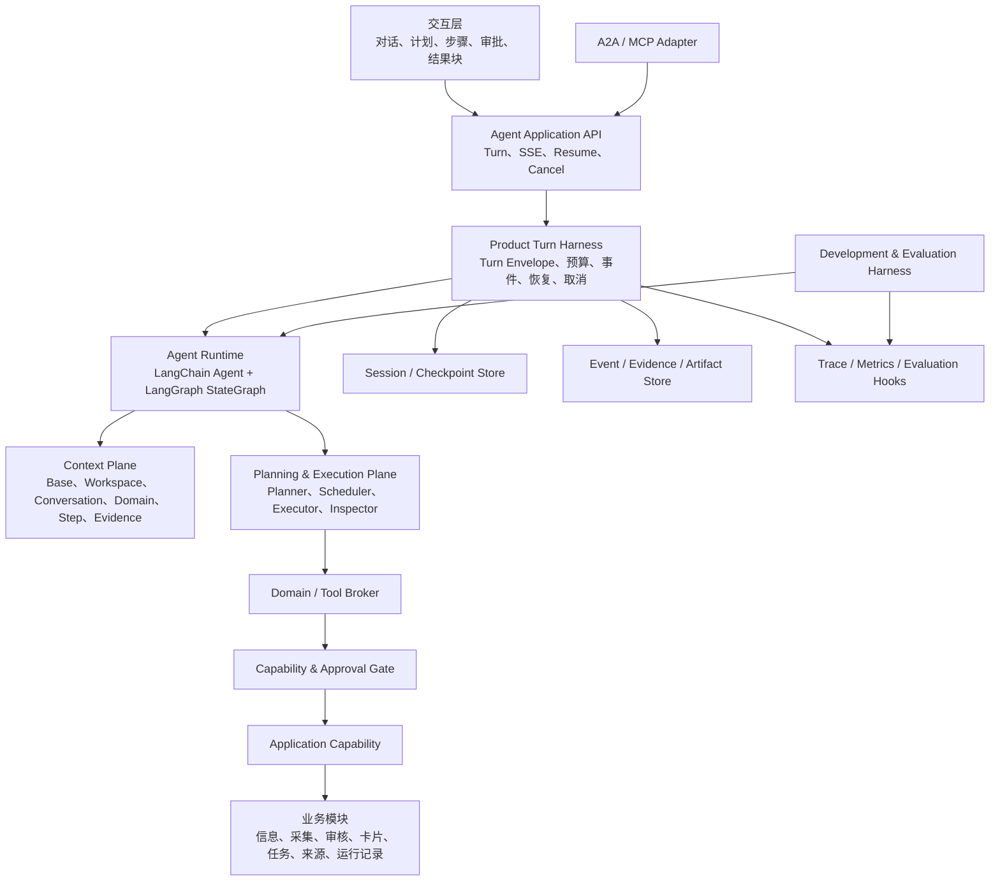
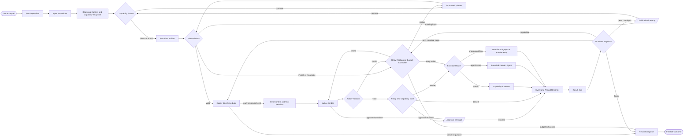

# 02-05 Workspace Agent 最终工程蓝图

> `workflow_version: 0.4.0`
> 状态：项目级目标蓝图；`0.4.0` 首个采集后推荐纵向切片已实现，其余能力仍按蓝图推进
> 适用范围：本地单工作区、单用户部署的 AI Signal Studio
> 审核入口：本对话负责蓝图适配性审查、修改建议确认与版本升级

---

## 1. 蓝图的用途

这份蓝图是后续 Agent 任务的共同导航，不是要求一次性建成的“大平台”。它回答五个问题：

1. Agent 最终应该能完成哪些站内工作；
2. 模型每一步能看到什么上下文和工具；
3. LangChain、LangGraph 与现有 Capability 分别负责什么；
4. 长任务如何暂停、恢复、追踪、评测和继续交付部分结果；
5. 新方法与项目体量不匹配时，如何先提出修改建议，而不是直接扩大范围。

“最终”表示当前已经收敛的工程方向，不表示永远不能修改。任何修改必须说明观察到的
真实问题、可验证收益、增加的复杂度、迁移方式与回退方案，然后由本对话审核并更新
`workflow_version`、任务、Graph Spec、历史图谱和 Figma。

---

## 2. 项目适配结论

AI Signal Studio 最适合的是：

- **一个面向用户的 Workspace Agent**，而不是多个会争夺对话控制权的角色 Agent；
- **LangChain Agent Framework + LangGraph Runtime**，而不是继续扩展关键词分支或
  自制 Tool Loop；
- **确定性业务工作流与模型动态规划混合**，而不是把所有动作都交给模型；
- **模块自带 Domain Pack 与 Capability Adapter**，而不是建立独立插件市场；
- **本地 SQLite 持久化与追加式事件记录**，而不是 Kafka、Celery 集群或微服务；
- **离线评测默认本地运行，可选接入 LangSmith**，而不是让云端服务成为产品必需依赖；
- **A2A/MCP 复用同一业务能力和任务结果**，而不是再实现一套 Agent。

以下做法当前不适合本项目：

- Deep Agents、Claude Agent SDK 等带文件系统、Shell 和通用代码执行的完整 Harness；
- CrewAI/AutoGen 式常驻多 Agent 组织；
- Kubernetes、多实例调度、分布式队列、向量数据库和独立工作流平台；
- 让模型直接访问数据库、环境变量、API Key、浏览器 DOM 或任意 Python 函数；
- 为普通 CRUD 强制创建子图或让模型判断确定性的业务规则；
- 保存或展示模型私有思维链。

---

## 3. 研究基础与项目取舍

| 成熟做法 | 一手资料 | 本项目取舍 |
|---|---|---|
| 从简单、可组合模式开始，仅在收益明确时增加 Agent 复杂度 | [Anthropic：Building effective agents](https://www.anthropic.com/engineering/building-effective-agents) | 保持单 Workspace Agent；明确流程优先受控 Subgraph |
| Context 是有限注意力预算，需要持续选择、压缩与隔离 | [Anthropic：Effective context engineering](https://www.anthropic.com/engineering/effective-context-engineering-for-ai-agents) | Base、Domain、Step、Evidence 分层；不发送完整信息库或完整历史 |
| Framework、Runtime 与 Harness 是不同层次 | [LangChain：Runtimes, frameworks, and harnesses](https://docs.langchain.com/oss/python/concepts/products) | LangChain 做 Framework，LangGraph 做 Runtime，项目只实现轻量业务 Harness |
| 长任务依赖结构化交接、增量进展和可验证完成条件 | [Anthropic：Effective harnesses for long-running agents](https://www.anthropic.com/engineering/effective-harnesses-for-long-running-agents)、[Harness design for long-running application development](https://www.anthropic.com/engineering/harness-design-long-running-apps) | Turn、Plan、Checkpoint、Artifact 与任务清单成为可恢复事实；不靠聊天文本猜进度 |
| Agent Harness 与 Evaluation Harness 需要分开 | [Anthropic：Demystifying evals for AI agents](https://www.anthropic.com/engineering/demystifying-evals-for-ai-agents) | 一套运行 Harness 服务用户，一套评测 Harness 运行场景、记录轨迹并判定 Outcome |
| Agent 应先从单 Agent、清晰工具与分层 Guardrail 起步 | [OpenAI：A practical guide to building agents](https://openai.com/business/guides-and-resources/a-practical-guide-to-building-ai-agents/) | 不引入生产多 Agent；工具选择与审批均受 Capability Policy 约束 |
| LangGraph 提供持久执行、stream、HITL 与 checkpoint | [LangGraph Overview](https://docs.langchain.com/oss/python/langgraph/overview)、[Persistence](https://docs.langchain.com/oss/python/langgraph/persistence)、[Interrupts](https://docs.langchain.com/oss/python/langgraph/interrupts) | 主任务使用真实 `StateGraph`、持久 Checkpointer 和 `interrupt()` |
| Context 可通过 Middleware 动态更新 Prompt、Tool、Model 与输出格式 | [LangChain：Context engineering](https://docs.langchain.com/oss/python/langchain/context-engineering) | 使用内置 Middleware 扩展点，不自制另一套 Agent 生命周期 |
| 工具数量变大时使用 Catalog → Inspect → Execute 渐进发现 | [MCP Client Best Practices](https://modelcontextprotocol.io/docs/develop/clients/client-best-practices) | 首版按 Domain 装载；只有工具定义超过上下文预算阈值才增加搜索层 |
| 评测要检查最终环境 Outcome 和轨迹，而不只比最终文案 | [LangSmith Evaluation](https://docs.langchain.com/langsmith/evaluation)、[Evaluate a graph](https://docs.langchain.com/langsmith/evaluate-graph) | 先用本地 Dataset + pytest Grader；LangSmith 为可选增强 |
| 过度授权与间接 Prompt Injection 是 Agent 的核心风险 | [OWASP：Excessive Agency](https://genai.owasp.org/llmrisk/llm062025-excessive-agency/) | 最小工具面、外部内容不可信、写动作审批、执行层二次校验 |
| A2A 用 Task、Message、Artifact 与 streaming 表达长任务 | [A2A 1.0 Specification](https://github.com/a2aproject/A2A/blob/main/docs/specification.md) | A2A 只做同一 Turn/Run/Artifact 的协议投影，不暴露内部 Graph |

这些资料提供原则，不自动成为依赖。新增 SDK、云服务或架构层必须先通过第 15 节的
适配性审查。

---

## 4. 总体工程分层



### 4.1 各层唯一职责

| 层 | 负责 | 不负责 |
|---|---|---|
| UI / API | 创建 Turn、展示流式状态、提交批准/补充、取消与恢复 | 业务规则和模型规划 |
| Product Turn Harness | 一次 Agent Turn 的生命周期、预算、版本快照、checkpoint、事件和取消 | 决定业务结果 |
| Context Plane | 选择、写入、压缩、隔离每次模型调用的上下文 | 执行业务动作 |
| Planner / Scheduler | 结构化目标、依赖、就绪步骤、失败策略和重规划 | 绕过 Capability Gate |
| LangChain Agent | 模型调用、Structured Tool、Middleware、结构化输出 | 长任务持久编排 |
| LangGraph | 节点、路由、并行、stream、checkpoint、interrupt/resume | 复制模块 CRUD |
| Tool Broker | 根据 Domain、开关、Actor Policy 和步骤装配工具 | 执行权限最终判定 |
| Capability | 权限、审批、业务校验、幂等、调用记录 | 解释自然语言 |
| Module Service | 业务事实与状态变化 | Agent 专属分支 |
| Evaluation Harness | 运行场景、记录轨迹、Grader、回归比较 | 服务真实用户 Turn |

### 4.2 九个工程关注面

它们是设计与审阅职责，不要求创建九个常驻 Agent 或九套服务。

| 关注面 | 核心问题 | 主要制品 |
|---|---|---|
| Product / Domain Engineering | 用户真正要完成什么，业务事实在哪里 | 用户场景、Application Service、Capability |
| Context Engineering | 每次模型调用应该看到什么 | Base Prompt、Domain Pack、Context Snapshot、压缩策略 |
| Tool Engineering | 模型如何可靠调用业务能力 | Structured Tool、Pydantic Schema、Tool Error |
| Workflow Engineering | 固定流程与动态规划如何组合 | AgentPlan、StateGraph、Domain Subgraph |
| Harness Engineering | Turn 如何受控、恢复、取消和降级 | TurnEnvelope、预算、Journal、Checkpointer、Finalizer |
| Memory / Evidence Engineering | 哪些事实保留、如何引用与撤销 | Conversation Summary、EvidenceBundle、ArtifactRef |
| Evaluation Engineering | 改动是否真的更好 | Scenario Dataset、Trial、Grader、Baseline |
| Observability / Safety Engineering | 哪里失败、是否越权或泄密 | Trace、Metric、Policy、Approval、Redaction |
| Interaction Engineering | 如何让用户理解并控制 Agent | Plan UI、ResultBlock、审批卡、恢复与深链 |

---

## 5. Context Engineering 蓝图

### 5.1 每次模型调用的上下文栈

```text
Base Prompt
+ Workspace Policy / Agent Pack
+ Conversation Window or Rolling Summary
+ Selected Domain Prompt
+ Current Plan Step
+ Bounded Evidence References
+ Selected Tool Schemas
+ Required Response Schema
```

信任顺序固定为：

```text
Base > Workspace Policy > Domain > Task / Step > Tool Result > External Evidence
```

低信任内容只能作为数据，不能修改高信任规则。

### 5.2 Context 的四类动作

| 动作 | 本项目实现 |
|---|---|
| Write | 将 Tool 结果写成稳定 ID、摘要、计数、错误和 EvidenceRef，不写大正文 |
| Select | 根据当前 Domain、步骤依赖、时间/来源/数量约束选择最小充分上下文 |
| Compress | 超过预算时压缩旧消息和长工具结果，保留事实、决策、资源 ID 与未完成项 |
| Isolate | 不同并行步骤只拿自己的 Evidence Slice；模块 Prompt 与工具不交叉泄漏 |

### 5.3 预算

首版使用可配置的比例预算而不是写死模型 Token 数：

| 区域 | 默认上限 |
|---|---:|
| Base + Workspace | 15% |
| Conversation Window / Summary | 20% |
| Domain + Tool Schema | 20% |
| Step + Evidence | 30% |
| 输出与安全余量 | 15% |

额外规则：

- 每一步最多 3 个 Domain、8 个可见工具；
- 单个工具结果进入模型前默认不超过 8 KB；
- 超限内容保存为 Artifact，只在上下文中保留引用和有界摘要；
- 工具 Schema 占可用上下文超过 5% 时，才启用 Catalog → Inspect 渐进发现；
- 压缩前后的事实引用必须可追踪到原始 Resource ID。

### 5.4 记忆

| 类型 | 生命周期 | 内容 | 写入方式 |
|---|---|---|---|
| Transient Context | 单次模型调用 | 当前 Prompt、工具和 Evidence Slice | Middleware 动态装配 |
| Working State | 单个 Turn | Plan、步骤状态、预算、结果引用 | LangGraph State |
| Conversation Memory | 单个对话 | 最近消息、滚动摘要、用户明确决策 | Checkpointer / Conversation 表 |
| Workspace Memory | 跨对话 | 用户明确保存的偏好、方案和 Agent Pack | 受控 Capability |
| Evidence / Artifact | 独立资源 | 信息、来源、报告、卡片、运行结果 | 业务表或 Artifact Store |

不得将模型自行推断的个人偏好直接写入长期记忆；必须由用户明确保存或在 UI 中确认。
不得保存私有思维链，只保存计划摘要、工具调用、可见说明、结果和错误。

### 5.5 EvidenceBundle

证据不是长 Tool 文本，而是一等、可追溯的数据契约：

```text
evidence_id
business_object_id
source_id
source_url
captured_at
title
excerpt
fact_fields
supports[]
contradicts[]
unknown_fields[]
content_hash
freshness
```

推荐、比较、趋势和专题结论只能引用当前 `EvidenceBundle` 中存在的记录。来源冲突时同时
保留支持和反对证据；证据不足时明确返回不足，不由模型补全。首版继续使用 SQLite 与
现有检索能力；只有数据量和召回评测证明需要时才引入 FTS5、Embedding 或向量库。

---

## 6. Harness Engineering 蓝图

### 6.1 Product Turn Harness

这是产品运行时的一层轻量外壳，由项目实现并运行在 FastAPI 进程内，不是新的通用
Agent SDK。每个 Turn 创建一个 `TurnEnvelope`：

```text
conversation_id
turn_id
thread_id
workflow_version
base_prompt_version
domain_pack_versions
model_config_ref
capability_snapshot
budget
deadline
idempotency_key
status
last_event_sequence
```

标识关系固定为：

```text
conversation_id = 一段用户对话
turn_id = 一次用户请求及其可恢复执行
LangGraph thread_id = turn_id
business_run_ids = 采集、任务、卡片等业务 Run 的引用列表
checkpoint_id = 当前 Turn 的持久恢复位置
```

不同并发 Turn 不共享一个 Graph `thread_id`，避免会话内状态互相污染。

轻量 Harness 由以下确定性组件组成：

| 组件 | 职责 |
|---|---|
| `ExecutionManifest` | 固定 workflow、state、plan、event、prompt、domain、tool 与 model 版本 |
| `TurnLease` | 单个 Turn 同时只允许一个有效执行者，过期后由恢复扫描接管 |
| `DeadlineBudget` | 总耗时、模型调用、Tool 调用、Token、候选数量和并行上限 |
| `RetryProfile` | 仅重试超时、限流、连接中断和明确 5xx，指数退避且有上限 |
| `CancellationToken` | 在 Scheduler、Agent、Subgraph 与 Capability 边界传播取消 |
| `EventJournal` | 事件先持久化再发送 SSE，保证序号、续传与最终事件 |
| `ArtifactStore` | 保存长报告、比较表和大 Tool 结果，Graph State 只存引用 |
| `RecoveryScanner` | 启动时检查 running、waiting 与 stale Turn |
| `Finalizer` | 统一写终态、结果块、最后事件并释放租约 |
| `DegradedMode` | 模型不可用时保留确定性 UI/REST 快捷动作，不伪装 Agent 成功 |

它必须提供：

1. **启动与去重**：同一 `turn_id + request_digest` 只创建一个 Run；
2. **版本快照**：记录实际使用的 Graph、Prompt、Domain、Tool 与模型配置版本；
3. **持久执行**：使用 LangGraph SQLite Checkpointer，进程重启后可恢复；
4. **有序事件**：Graph stream 投影为持久 `AgentTurnEvent`，SSE 通过序号续传；
5. **预算与截止时间**：限制步骤、Tool Call、replan、模型调用、Token、耗时；
6. **错误分类**：用户输入、能力禁用、审批拒绝、外部依赖、模型、系统分别处理；
7. **部分成功**：只停止失败步骤的依赖后继，独立分支继续；
8. **取消**：节点边界检查取消标记，保存已完成结果与 checkpoint；
9. **副作用安全**：所有写动作携带幂等键，恢复和 replay 不重复写；
10. **结束整理**：持久化 Outcome、ResultBlock、ArtifactRef 与后续建议。

SQLite 使用 WAL、短事务和单写入协调。只有确认要多进程或多实例部署时，才评估
PostgreSQL Checkpointer；不提前引入分布式队列。

业务数据库与 Checkpoint 建议分别保存在：

```text
data/ai-signal-studio.db
data/agent-checkpoints.db
```

进程启动时由 `RecoveryScanner` 检查未终结 Turn。它只恢复经过版本兼容校验的任务，
不会盲目重放外部副作用。

### 6.2 Development & Evaluation Harness

开发 Harness 不服务真实用户，负责回答“这次 Prompt、Graph、模型或工具变化是否真的
更好”：

```text
Scenario Dataset
→ Deterministic Workspace Fixture
→ Agent Runtime Trial
→ Transcript / Trace / Outcome
→ Code Graders + Optional Judge
→ Baseline Comparison
→ Regression Report
```

首个纵向闭环先以简单 TDD 验收；完成后再建立第一批 24 个手工高质量场景，覆盖核心
闭环和故障路径，真实失败脱敏后逐步扩展到 40 个左右。每个场景包含：

```text
scenario_id
initial_workspace_fixture
user_turns
enabled_capabilities
approval_responses
failure_injections
expected_outcome
required_tool_calls
forbidden_tool_calls
latency_and_call_budget
```

Grader 顺序：

1. **Outcome Grader**：数据库、Run、Artifact 或状态是否真的满足目标；
2. **Contract Grader**：Plan、Tool 参数、ResultBlock、引用和事件 Schema；
3. **Trajectory Grader**：是否选择正确 Domain/Tool，是否有越权或无意义循环；
4. **Safety Grader**：是否抵抗外部内容指令、保护 Secret、执行必要审批；
5. **Reliability Grader**：断线、重启、部分失败、取消、resume 和幂等；
6. **UX Grader**：输出是否可操作、能定位 AI 信息、错误是否可理解；
7. **Cost/Latency Grader**：步骤、模型调用、Token 和耗时是否在预算内；
8. **LLM Judge**：只用于推荐、比较、简报等难以完全确定性判断的质量维度。

测试默认使用确定性 Fake Model，但必须经过真实 LangChain/LangGraph/Tool/Capability
路径。真实模型不进入单元、模块或普通 E2E；只在确定性全量回归通过后的完整链路发布
验收中执行一个有硬预算的代表性 Trial。只有用户明确追加额度并进入可靠性评测阶段，
才对同一完整场景运行多次 Trial，不能用模块级 Smoke 代替。LangSmith 可作为可选
Trace/Eval 后端；没有 LangSmith 时，本地 JSONL/数据库 Trace 与 pytest Grader 必须
完整可用。

### 6.3 Evaluator 的适用边界

- 参数、Schema、权限、引用、数量、时间、状态与业务 Outcome 使用代码验证；
- 推荐理由、比较完整性、专题简报质量可以使用独立 Judge；
- Judge 不复用生成调用的上下文，不读取私有推理，只看任务、证据与可见产物；
- 最多一轮“生成 → 评价 → 修订”，除非评测证明更多轮次有显著收益；
- 生产 Turn 不默认启动“多 Agent 评审团队”。

### 6.4 优先复用的 Harness 组件

在稳定 API 能满足需求时优先使用 LangChain/LangGraph 内置能力：

- Agent Middleware：动态 Prompt、动态 Tool、调用前后校验与 Trace Hook；
- Summarization Middleware：按 Token 阈值压缩旧对话；
- Model/Tool Call Limit Middleware 或稳定等价能力：调用预算；
- Human-in-the-loop Middleware / LangGraph `interrupt()`：批准和补充；
- LangGraph Retry Policy：只处理明确可恢复错误；
- LangGraph Checkpointer、`Command`、`Send` 与 stream v2：恢复、并行和事件。

如果某项内置 Middleware 仍不稳定或不能表达业务错误语义，项目只写一个窄 Adapter，
不复制完整 Agent Loop。

---

## 7. Tool 与 Capability Engineering

### 7.1 模块拥有自己的 Agent 贡献包

```text
modules/<domain>/
  domain/
  application/
  agent/
    domain.yaml
    prompt.md
    tools.py
    schemas.py
    result_blocks.py
    examples/
    workflows/
```

`tools.py` 只能把 Application Capability 适配为 LangChain Structured Tool，不能直接
访问数据库或复制 Service 逻辑。

### 7.2 发现与执行

```text
Domain Index
→ Planner 选择 Domain
→ Tool Resolver 加载简述
→ 必要时 Inspect 完整 Schema
→ Capability Gate 求权限交集
→ LangChain 暴露本步骤 Tool
→ Executor 再次校验并调用 Capability
```

模型能看见 Tool 不等于有权执行。真实可执行集合为：

```text
Installed Module
∩ Feature Switch
∩ Agent Pack
∩ Actor Policy
∩ Approval Scope
∩ Step Allowlist
```

### 7.3 工具设计规则

- 一个工具只表达一个清晰业务动作；
- 名称以业务目标为中心，参数使用 Pydantic Schema；
- 查询工具返回紧凑分页结果和 Resource ID，不返回 ORM 对象；
- 写工具默认先产生 Preview/Diff，再按策略批准后 Apply；
- Tool Error 使用稳定错误码和 `retryable/user_action/partial` 元数据；
- Secret 只以内部引用存在，永不进入 Tool Schema、Trace 或模型上下文；
- 所有外部副作用使用幂等键；
- Catalog、Runtime Registry、Domain Pack 与 Adapter 必须自动校验一致。

### 7.4 Action 与 Approval 契约

审批不能只绑定“计划做什么”的自然语言。`Action Binder` 必须先产生：

```text
ActionEnvelope
  turn_id
  step_id
  domain_id
  capability_id
  canonical_input
  input_digest
  acceptance_policy
  side_effect
  risk
```

`Action Validator` 完成 Pydantic Schema、资源存在性和确定性约束校验后，才能进入
Capability Policy 与审批。Approval Token 使用统一超集：

```text
actor_id
workspace_id
turn_id
step_id
capability_id
input_digest
expires_at
single_use
consumed_at
```

用户在审批卡中修改参数时，必须回到 `Action Binder` 重新生成并校验摘要，旧 Token
立即失效。

---

## 8. Planning、执行与检查

### 8.1 单步骤也使用真实 Graph

简单查询可以走“单步骤快速路径”，但它仍然创建 `AgentPlan`、Run 和事件，并进入同一
LangGraph；不得退回关键词 `if/return` 路径。

规划分为三条受控路径：

1. **Direct Response Plan**：帮助、解释和当前页面说明，不调用业务 Tool；
2. **Deterministic Fast Plan**：来自快捷按钮、已结构化 ClientCommand 或明确的单能力
   动作，不额外调用 LLM Planner；
3. **Structured LLM Plan**：自然语言多意图、跨 Domain、并行、分析、长任务或审批。

三条路径输出同一个 `AgentPlan` Schema。自然语言是否属于 Fast Plan 不能依赖旧式关键词
分支；无法通过确定性结构判断时一律进入 Structured LLM Plan。

### 8.2 结构化计划

```text
AgentPlan
  objective
  constraints
  assumptions
  planning_mode
  selected_domains
  steps[]
    step_id
    goal
    kind
    domains
    dependencies
    input_refs
    success_criteria
    acceptance_policy
    side_effect
    risk
    failure_policy
  max_replans
  budget
```

- 顶层最多 5 步；
- 独立只读步骤可并行，写步骤顺序执行；
- Planner 不执行工具、不批准自己、不猜测 Resource ID；
- 复杂、已知业务流程进入模块 Subgraph；
- 最多重规划 2 次；
- 条件不足时只暂停受影响分支，先完成独立步骤。

`success_criteria` 是用户可读说明，不作为唯一机器判断。每一步还必须引用注册的验收
策略，例如：

```yaml
acceptance_policy:
  id: information_results.v1
  params:
    min_items: 1
    require_information_id: true
    require_source_url: true
```

Domain Validator 根据该策略检查 Outcome；模型不能返回一段自由文本来自我宣布完成。

### 8.3 Outcome Inspector

检查顺序固定为：

1. Result Schema；
2. Capability Invocation 与 Resource ID；
3. 时间、来源、数量、最大字数等确定性约束；
4. 步骤成功条件和未完成依赖；
5. 必要时的独立质量 Judge。

Inspector 只能返回：

```text
continue
replan
await_user
await_approval
complete
partial_complete
failed
cancelled
```

它不能执行工具或修改 Base Policy。

---

## 9. 最终 Turn 工作流



### 9.1 节点解释

- `N02` 是 Product Turn Harness 入口，建立版本快照、幂等键、租约、预算和取消标记；
- `N04` 只装配 Base、Workspace、对话摘要、Capability Snapshot 和 Domain Index；
- `N05` 只在结构化输入能安全判定时选择 Fast Plan，否则进入 LLM Planner；
- `N10` 根据依赖和失败策略选择就绪步骤，并使用 `Send` 调度独立只读步骤；
- `N11` 只为当前步骤选择 Domain、Evidence、Token 预算和最小 Tool 集合；
- `N12` 产生真实结构化参数，`N13` 通过 Schema 后才能计算 `input_digest`；
- `N14` 是权威执行门，审批必须绑定已验证的动作参数；
- `N18` 是有预算的 LangChain Domain Agent，不是新的常驻用户 Agent；
- `N20` 先持久化事件、证据和 Artifact 引用，`N21` 完成并行 fan-in；
- `N22` 确定性检查优先，必要时才调用独立质量 Judge；
- `N25` 统一写入 `complete/partial/failed/cancelled` Outcome、最后事件并释放租约；
- `waiting_input/waiting_approval` 是 `N09/N15` 的 Turn 状态投影，不占业务节点；
- `N09` 与 `N15` 使用 LangGraph `interrupt()`，以同一 `thread_id` 恢复。

当前机器规格：
[Agent Task Graph 0.4.0](../../graph-specs/02-module-review-agent/02-agent-task-graph.yaml)。

当前 Figma 图与历史版本：

- [Figma 当前 Agent 工作流 0.4.0](https://www.figma.com/board/dF7TcDtCd3J96E0Bb0F5Ad)；
- [Agent 工作流历史图谱](02-04-agent-workflow-history.md)。

---

## 10. 站内能力蓝图

| Domain | 只读能力 | 受控写能力 | 复杂 Subgraph |
|---|---|---|---|
| Intelligence | 查询、详情、筛选、比较、趋势、证据 | 已读、收藏、备注、归档、保存视图 | 推荐、专题简报、采集后分析 |
| Collection | 来源、健康、Run、错误、覆盖 | 新增/修改/启停来源、开始采集、重试 | 多来源采集与覆盖分析 |
| Review | 批次、条目、建议、历史决定 | 保留、拒绝、延后、批量提交 | 规则筛选与人工确认 |
| Cards | 草稿、模板、历史产物 | 生成、编辑、渲染、发布 | 多卡生成与质量检查 |
| Tasking | 任务、版本、预览、Run | 创建、修改、启停、运行、重试 | 任务设计、预览、版本切换 |
| Models | 可用模型、能力、连接状态 | 选择默认模型、连接测试 | 无；密钥只由设置 UI 输入 |
| Conversations | 查询、搜索、历史 | 新建、重命名、置顶、归档、恢复 | 无 |
| Appearance | 主题与令牌读取、预览 | 生成 ClientCommand，用户点击应用 | 无 |
| Runs | Turn、Step、Invocation、Artifact | 取消、恢复、受控重试 | 运行复盘与修复建议 |

高风险修改不向模型暴露 Secret 输入框；Agent 只生成设置导航或无密钥的配置草稿。
物理删除、发布、覆盖长期记忆和跨工作区动作不在首版 Agent 能力中。

---

## 11. 结果与交互

Agent UI 不展示内部思维链，而展示可验证的工作状态：

```text
用户目标
计划摘要
当前步骤 / 已完成步骤 / 耗时
正在使用的信息源或站内资源
等待补充或审批
结果块与站内跳转
部分失败和可继续操作
```

核心 ResultBlock：

- `information_list`
- `recommendation_list`
- `information_comparison`
- `research_brief`
- `trend_brief`
- `evidence_sources`
- `review_decision_preview`
- `card_draft_list`
- `task_draft`
- `task_diff`
- `task_preview`
- `source_health_matrix`
- `run_retrospective`
- `approval_request`
- `partial_failure`
- `navigation_action`

每条 AI 信息必须携带真实 `information_id`、标题、短摘要、来源、时间、颜色标识、
推荐理由、原地址和站内深链。

---

## 12. 可观测性

本地默认记录：

```text
Run
  ├─ Graph Node Span
  ├─ Model Call Span
  ├─ Tool / Capability Span
  ├─ Checkpoint Event
  ├─ Approval / Clarification Event
  └─ Result / Error / Budget Event
```

必备字段：

```text
turn_id, conversation_id, business_run_ids, workflow_version
node_id, step_id, domain_ids, capability_id
model_ref, prompt_versions, exposed_tools
started_at, duration_ms, retry_count
input_tokens, output_tokens
status, error_code, resource_refs
```

OpenTelemetry GenAI 语义约定可作为字段命名参考，但当前 GenAI 约定仍可能变化，因此
本项目先维持稳定的内部 Schema，再写可替换 Exporter。不得默认记录完整 Prompt、
Tool 参数、Tool 结果、个人信息或 Secret。

---

## 13. 高可用与故障模型

本项目的“高可用”是单机部署范围内的可恢复性：

- API 或浏览器刷新后，Run 与对话不会丢失；
- 进程重启后，从最近 checkpoint 恢复；
- SSE 断线后从事件序号续传；
- 某来源、信息或独立步骤失败时返回部分结果；
- 用户可取消、补充、批准和重试；
- replay 不重复副作用；
- Checkpointer、Schema 或工作流版本不兼容时返回可定位错误；
- 一键启动脚本只报告基础服务状态，中文诊断由 Python 脚本输出或写入日志。

首版不承诺机器故障后的自动接管、多地域容灾或多实例无缝切换。

---

## 14. 任务推进蓝图

### 阶段 A：Context Contract

- 锁定 LangChain/LangGraph 依赖；
- Base Prompt、Domain Pack、Context Budget 与版本快照；
- Catalog/Registry/Domain/Adapter 一致性测试；
- 交付“未选 Domain 不进入模型请求”的失败测试。

### 阶段 B：Product Turn Harness

- Turn/Step/Event/ResultBlock 数据与 SSE；
- TurnEnvelope、取消、恢复、幂等和 SQLite Checkpointer；
- 真实 LangGraph 0.4.0 骨架；
- 每个用户行为只先写 2～6 个关键失败测试，不用大型评测集阻塞首个成品；
- 交付重启恢复、断线续传、重复请求不重复写测试。

### 阶段 C：Planner 与 Intelligence 闭环

- Structured Planner、Plan Validator、Scheduler、Inspector；
- 查询、筛选、推荐、比较和采集后分析；
- 结果块与 AI 信息深链；
- 交付多请求部分成功和错误分支测试。

### 阶段 D：Evaluation Harness 基座

- 首个纵向闭环验收后，再建立 24 个代表性场景、Workspace Fixture、Fake Model/Tool 与
  固定时间；
- 实现 Outcome、Contract、Trajectory、Safety 和 Reliability Grader；
- Fake 组件必须运行真实 LangChain/LangGraph/Tool/Capability 路径；
- 交付 Context Snapshot、Failure Injection 与版本对比基线。

### 阶段 E：受控站内动作

- 来源、审核、卡片、任务、运行记录、会话和模型边界；
- Preview/Diff/Approval/Apply；
- Capability Policy、Actor Policy 与调用审计；
- 交付禁用能力、审批拒绝、Prompt Injection 和幂等测试。

### 阶段 F：评测扩展与协议

- 将真实失败轨迹扩展为约 40 个回归场景；
- Fake Model 回归；用户配置真实模型只用于最终完整链路 Trial；
- 外部 Agent Gateway 进入最终互操作阶段后再进行 MCP/A2A 协议投影；
- 可选 LangSmith/OTel Exporter；
- 交付版本对比报告与图谱同步检查。

每个阶段先完成一个前端 + Agent + Capability + 测试的垂直闭环，再扩展下一组能力。

---

## 15. 适配性审查与修改机制

### 15.1 触发条件

出现以下任一情况时，实施任务不能自行偏离蓝图，必须在本对话提出修改建议：

- 现有 LangChain/LangGraph API 无法满足已验证场景；
- 运行指标证明上下文、工具、步骤或模型预算不合适；
- 某个确定性流程被模型化后可靠性下降；
- SQLite 无法满足实际并发或恢复需求；
- 新增 SDK 会复制 Capability、Graph 或 Harness 职责；
- 安全、隐私、许可证或部署限制与蓝图冲突；
- 用户工作流证明当前节点、结果块或审批粒度不合适。

### 15.2 修改建议模板

```text
观察到的问题：
复现与证据：
受影响的用户场景：
当前蓝图为什么不适合：
建议修改：
继续使用现状的代价：
新增复杂度与风险：
迁移与回退方式：
需要更新的任务 / 契约 / Graph / Figma / 测试：
```

### 15.3 审核结论

本对话给出以下之一：

- `接受`：升级 `workflow_version` 并同步全部图谱与任务；
- `试验`：放在 Feature Flag 下，用评测 Dataset 比较后再决定；
- `缩减`：保留目标但选择更简单实现；
- `推迟`：记录触发指标，不进入当前批次；
- `拒绝`：收益不足或超出项目边界。

不得以“更先进”“以后可能有用”作为接受理由。

---

## 16. 完成定义

最终蓝图只有在以下证据同时具备时才算进入可用产品：

1. 用户通过 UI 完成至少一条跨模块复杂任务；
2. Agent 使用真实 LangChain Agent、LangGraph StateGraph 和持久 Checkpointer；
3. Base + Domain + Step Context 与动态 Tool 在 Trace 中可验证；
4. 所有业务动作只通过 Capability；
5. 暂停、批准、恢复、取消、重启、断线和幂等测试通过；
6. 多请求可部分成功，不因独立失败中断全部回复；
7. AI 信息结果包含真实来源、简述和站内跳转；
8. Evaluation Harness 能比较 Prompt/Graph/模型版本；
9. REST、Agent 与 A2A 复用同一 Plan/Result/Artifact 事实；
10. Graph Spec、历史 Markdown、Figma、任务状态和验收证据使用同一版本。

在此之前，文档必须明确标注“目标蓝图”，不能把设计内容写成已经实现。

## 17. 0.6.0 Blueprint Change Proposal 审核记录

审核结论：**接受最小修改**。不新增第二套 Runtime，不改变 N01～N25 主节点，只扩展
Plan/Context/N16/N18/ResultBlock 契约。

- 观察：语境型追问被 0.5.0 强制规划为工具链，在缺少条目级候选时全部步骤未执行；
- 修改：新增只读 `model_reasoning`，工具从“每步必选”改为“事实与动作优先、推理可选”；
- 约束：模型只能使用有界会话与已完成步骤输出，不能虚构工作区 ID、实时事实或工具结果；
- 连接策略：新建/编辑标记待检测，用户显式检测；疑似 Provider 错误标记需复检，
  正常 Turn 不预检；
- 兼容：核心契约保持 OpenAI-compatible 中性，OpenAI 与阿里云等差异继续只放在
  Provider Compatibility Adapter；
- 迁移：已完成旧 Turn 只读；未完成 0.5.0 checkpoint 不由 0.6.0 静默恢复；
- 回退：恢复 0.5.0 Runtime，继续只读显示 0.6.0 Turn，不删除会话或结果；
- 同步：Graph Spec、历史、本文、状态、契约与测试使用 `workflow_version=0.6.0`；
  Figma 仍需同一目标文件的明确写入授权。

### 17.1 0.6.0 空证据执行语义修订

审核结论：**接受既有范围内的 Bug 修复**。不增加节点、不增加第二套 Planner，也不让
模型绕过 Capability 读取业务数据。

- 问题证据：查询返回 0 条触发 N22 失败，导致推荐与趋势被依赖跳过；
- 最小修改：可验证的覆盖不足使用 `partial` 并继续；真正的 Schema、引用或 Provider
  错误仍按失败处理；
- 模型职责：N18 对 Capability 给出的候选完成推荐语义判断和跨条目综合；
- 调用预算：推荐与趋势共用一次结构化分析，完整研究 Turn 仍保持一次 Planner 加一次
  研究模型调用；
- 空证据边界：允许模型解释为什么无法推荐或总结，但不允许产生任何虚构条目、引用或
  当前事实；
- Provider 归一化：结构化输出中的重复/无效 ID 被过滤；不足数量只从 Capability
  已排序的真实候选补齐；趋势引用只落到本轮真实选择。保留模型有效理由并记录修复，
  不增加模型调用；载荷解析兼容已解析对象、OpenAI `tool_calls.arguments` 与正文 JSON；
- 回退：恢复 `research.recommend=capability` 和 N22 原判定即可；已保存 Turn 与
  ResultBlock 保持只读，不删除用户数据。

### 17.2 Blueprint Change Proposal：缺证据时按需联网补充

状态：**用户已明确要求并接受最小修改；按 `workflow_version=0.7.0` 实施。**

- 问题证据：当前只有 RSS 与 GitHub Releases 等 3 个真实来源启用；24 小时窗口可能
  合法返回 0，扩大到已保存 3 天背景仍不能保证覆盖最新事件；
- 最小修改：在“精确查询 + 已保存背景补足”仍少于目标数量时，增加一个受控的
  `web.search.collect` 外部副作用能力和 N17 执行步骤；结果必须先进入 RawItem/Intelligence
  正常化、去重与引用流程，模型不得直接把搜索摘要当最终事实；
- 检索：增加 `intelligence.search`，以 `intelligence_id` 为唯一文档，统一覆盖
  pending、intelligence、archived、cards 阶段；采用 FTS5 BM25、短词子串兜底、
  RRF 融合与 SimHash 近重复分组；
- 复杂度：两个 Capability Adapter、一个由本地候选数控制的条件执行和来源审计字段；不引入第二套 Agent、
  浏览器自治循环、插件市场或分布式队列；
- 幂等与安全：查询摘要作为幂等键一部分；域名允许/拒绝策略、超时、条数和正文大小
  有上限；外部内容按不可信输入处理；
- 迁移：新工作流版本只影响新 Turn，旧 Turn 只读；关闭能力开关即回到当前流程；
- 回退：移除条件边并禁用 `web.search.collect`，不删除已正常化入库的信息；
- Provider：首个 Adapter 为 Brave Search；核心输入输出不含厂商字段，可继续新增
  其他结构化 Search Provider。没有 API 密钥时返回中文、可操作的 `partial`，
  不抓取消费者搜索结果页；
- 同步：Graph Spec、历史、本文、状态、能力契约与测试升级到 0.7.0；Figma 仍需
  对既定 FigJam 的明确写入授权和截图核验。
