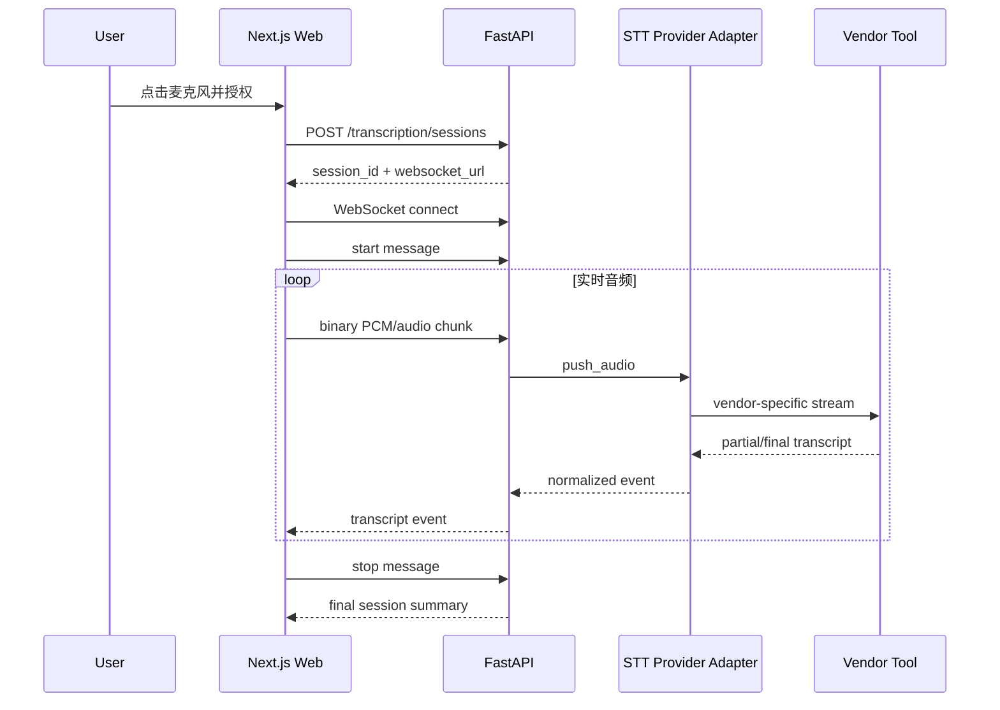

# 03-03 实时语音转文字

## 1. 范围

本模块只做：

```text
实时麦克风输入 → 增量转写 → 可编辑文字
```

不做：

- 上传音频文件作为主要流程；
- 语音合成；
- 语音通话 Agent；
- 自动把转写内容发送给 Agent；
- 默认保存原始录音。

## 2. 用户体验

- 文本框旁有麦克风按钮；
- 点击后请求浏览器麦克风权限；
- 显示“正在聆听”、音量、连接状态；
- partial text 使用浅色或下划线显示；
- final text 追加进可编辑输入框；
- 支持暂停、继续和结束；
- 用户手动点击发送后才提交文本；
- 断线时保留已确认文字并允许重连。

## 3. 数据流



## 4. 前端采集

推荐分两阶段：

### MVP

- `navigator.mediaDevices.getUserMedia({ audio: true })`；
- `MediaRecorder` 以小时间片产生音频块；
- WebSocket 发送二进制；
- 根据 Vendor Tool 支持的编码选择 `audio/webm;codecs=opus` 或 PCM。

### 需要更稳定低延迟时

- 使用 AudioWorklet 采集原始 PCM；
- 转为 mono、16 kHz、16-bit little-endian；
- 更精确地控制 chunk 大小、VAD 和背压。

不要第一天就实现复杂 AudioWorklet，除非选定的第三方工具明确要求 raw PCM。

## 5. 服务端边界

应用自己的模块只定义：

```python
class RealtimeSpeechToTextProvider(Protocol):
    async def open(self, config: SessionConfig) -> ProviderSession: ...
    async def push_audio(self, session: ProviderSession, chunk: bytes) -> None: ...
    async def events(self, session: ProviderSession) -> AsyncIterator[TranscriptEvent]: ...
    async def close(self, session: ProviderSession) -> TranscriptSummary: ...
```

Provider 输出统一事件：

```text
session.started
transcript.partial
transcript.final
session.warning
session.error
session.closed
```

## 6. 第三方工具隔离

目录：

```text
vendor_tools/speech_to_text/
├── README.md
└── whisperlive/
    ├── UPSTREAM.md
    ├── INTEGRATION.md
    └── LICENSE-NOTICE.md
```

原则：

- 第三方代码、子模块、部署脚本、补丁和许可证仅放在该目录；
- 我们自己的 Adapter 放在 `packages/adapters/speech_to_text/`；
- 不让业务模块直接 import Vendor Tool 内部包；
- 升级 Vendor Tool 时只修改 Adapter 与集成说明；
- 不复制无必要的整个上游仓库进主包，实际开发可选择 git submodule、独立 checkout 或容器/进程方式。

## 7. 默认候选：WhisperLive

选择理由：

- 面向实时麦克风转写；
- 支持客户端/服务端模式；
- 可使用 faster-whisper 后端；
- 支持 raw PCM 和手动音频分块等路径；
- 适合封装为本地可替换 Provider。

注意：Whisper 本身不是天然实时模型，实际延迟与硬件、模型大小、分块和 VAD 有关。第一版把“近实时、可连续输入”作为目标，不承诺毫秒级字幕。

备选：

- Whisper-Streaming：更强调自适应延迟策略；
- 云 STT Provider：当本地性能不足时通过相同 Protocol 接入。

## 8. WebSocket 协议

连接：

```text
/ws/transcription/{session_id}?token=<short-lived-token>
```

客户端文本消息：

```json
{"type":"start","language":"zh","format":"webm_opus","sample_rate":48000}
{"type":"pause"}
{"type":"resume"}
{"type":"stop"}
```

客户端二进制消息：音频 chunk。

服务端事件：

```json
{
  "type": "transcript.partial",
  "session_id": "stt_123",
  "segment_id": "seg_4",
  "revision": 3,
  "text": "这是一段正在识别的",
  "start_ms": 8400,
  "end_ms": 11200
}
```

```json
{
  "type": "transcript.final",
  "session_id": "stt_123",
  "segment_id": "seg_4",
  "revision": 4,
  "text": "这是一段正在识别的文字。",
  "start_ms": 8400,
  "end_ms": 11750
}
```

完整 JSON Schema 见 `contracts/03-realtime-transcription/realtime-transcription-protocol.schema.json`。

## 9. 会话状态

```text
CREATED → CONNECTED → STREAMING ↔ PAUSED → FINALIZING → CLOSED
                              ↘ ERROR
```

服务端只持久化：

- session_id；
- 用户/工作区；
- Provider；
- 状态；
- final transcript；
- 时间和错误；

默认不持久化音频块。

## 10. 背压与限制

- 限制单会话最长时长；
- 限制 chunk 大小与发送频率；
- 每用户并发会话限制；
- Provider 处理不及时，服务端发 `session.warning`；
- 客户端根据 bufferedAmount 暂停发送或降低频率；
- 断线后创建新 Provider 流，已 final 文本不丢失。

## 11. 安全

- 麦克风权限由浏览器明确授权；
- 使用短时 WebSocket token；
- 校验 Origin、用户和 session 归属；
- 日志不记录原始音频；
- partial transcript 可只保存在内存；
- UI 明确提示正在收音；
- 结束时主动停止 MediaStreamTrack。

## 12. 简单 TDD

最低测试：

1. 创建转写会话；
2. WebSocket 未授权被拒绝；
3. start → binary chunk → partial/final；
4. stop 后返回 final summary；
5. 超大 chunk 被拒绝；
6. Provider 失败转成统一 error event；
7. 前端结束后停止麦克风 track；
8. 转写文字不会在未经用户操作时自动发送给 Agent。
