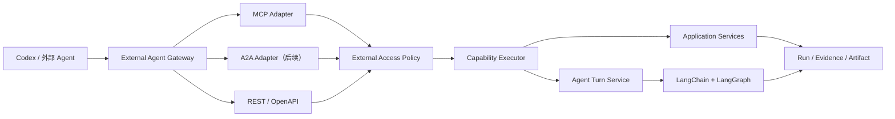

# 04-02 外部 Agent Gateway 设计

## 1. 决策状态

```text
状态：Deferred / 设计已完成
是否进入当前开发任务：否
默认是否启用：否
推荐实现顺序：REST/OpenAPI 继续作为事实接口 → MCP 本机只读入口 → A2A 长任务入口
```

该能力放在产品核心信息管理、任务、来源、运行、审核和 Agent 能力稳定之后实现。当前不
新增开发 Epic，不安装运行依赖，不开放端口，也不增加可被外部 Agent 调用的写能力。

延期不是因为需要重造一套 Agent。相反，接口本身应当很薄；真正需要先补齐的是外部
身份传播、Capability Actor Policy、审批、审计和长期任务状态映射。缺少这些边界时，
即使协议能够运行，也不能作为可靠产品能力交付。

## 2. 用户目标

允许 Codex、其他编程 Agent 或远程 Agent 在用户明确开启后：

- 查询 AI 信息、来源、任务和运行记录；
- 启动受控的采集或 Workspace Agent 长任务；
- 获取进度、结果、证据和站内跳转；
- 取消自己发起的任务；
- 在关闭总开关后立即停止接受新的外部调用。

这不是新的 Agent Runtime，也不是插件市场或通用函数控制台。外部 Agent 只通过薄
Adapter 调用现有 Application Capability。

## 3. 实践取舍

### 3.1 REST / OpenAPI 保持事实接口

REST 继续服务前端、脚本、测试和所有协议 Adapter。FastAPI 的 Pydantic Schema、
错误、幂等、Run 与 OpenAPI 是底层事实，不为 MCP 或 A2A 复制业务规则。

### 3.2 MCP 作为第一入口

Codex 桌面端、CLI 和 IDE 可直接连接 STDIO 或 Streamable HTTP MCP Server，并支持
Server 开关、工具白名单、工具级审批和超时。MCP 适合把已有的只读查询和短操作变成
可发现的 Tool/Resource，因此是让 Codex 使用本软件的最短路径。

首版不依赖仍可能存在客户端差异的长任务扩展。耗时操作使用稳定的三段式工具：

```text
start_* → 立即返回 run_id
get_run → 查询进度和结果
cancel_run → 请求取消
```

### 3.3 A2A 延后

A2A 适合一个 Agent 把完整目标委派给另一个 Agent，协议原生表达 Agent Card、Message、
Task、Artifact、流式更新和取消。它比 MCP 更适合长任务，但也要求外部身份、任务可见
范围、认证、Artifact 和恢复语义已经稳定。

本项目只有在存在明确的 A2A Client 和互操作验收对象后才实现 A2A；不为“将来可能
使用”提前建设第二套任务系统。

## 4. 当前适配性审计

### 已可复用

- `CapabilityExecutor` 是业务动作的统一入口；
- Workspace Agent 已有真实 LangChain/LangGraph 主路径；
- Agent Turn 已有持久事件、SSE 续传、取消、恢复和结果块；
- Run、Evidence 和站内路径可以投影为外部结果；
- `ExecutionContext` 已允许 `external_agent` 类型。

### 实现前必须补齐

- `agent_runtime/graph.py` 仍固定使用
  `actor_type="internal_agent"`、`actor_id="workspace-agent"`；
- `CapabilityExecutor` 当前只检查全局禁用项，没有 Actor Policy、scope 和工作区边界；
- Agent Turn 尚未完整持久化外部 actor、外部 context 和调用方可见范围；
- 没有服务端权威总开关、外部凭据、撤销和审计界面；
- MCP/A2A 示例契约还没有可运行 Adapter 和协议测试。

因此当前适合完成设计，不适合直接开放完整外部接口。

## 5. 目标架构



依赖方向固定为：

```text
协议 Adapter
→ External Access Policy
→ Capability Executor / Agent Turn Service
→ Application Service
```

Adapter 只负责：

- 协议 Schema 转换；
- 调用方身份与上下文解析；
- Task/Run/Artifact 状态映射；
- 稳定错误映射；
- 不含业务判断的发现元数据。

## 6. 一键关闭设计

服务端是权威开关，客户端开关只是第二层便利控制。

```text
external_agent_access_enabled = false
mcp_enabled = false
a2a_enabled = false
external_rest_enabled = false
```

关闭 `external_agent_access_enabled` 时：

1. 不接受新的外部请求；
2. MCP HTTP 路由返回稳定的 `EXTERNAL_AGENT_ACCESS_DISABLED`；
3. A2A Agent Card 不对外声明可用 Skill；
4. Capability Policy 即使收到绕过 Adapter 的调用也再次拒绝；
5. 已开始任务不产生新的外部副作用，可由用户选择安全取消或在站内继续；
6. UI 显示“已关闭”，不显示成网络故障；
7. 不删除历史 Run、Artifact 或审计记录。

设置页以后可提供一个主开关和三个协议子开关。主开关默认关闭，部署后由本机用户自行
开启，不引入登录系统。

## 7. 外部身份与策略

外部调用使用独立上下文：

```text
actor_type = external_agent
actor_id
workspace_id
external_context_id
protocol = mcp | a2a | rest
scopes[]
request_id
idempotency_key
```

有效能力集合：

```text
Capability Registry
∩ Feature Switch
∩ External Actor Allowlist
∩ Credential Scope
∩ Approval Policy
= Effective External Capabilities
```

默认拒绝。首版只允许显式列入白名单的只读能力。外部 Agent 不能读取模型密钥、完整
Base Prompt、隐藏推理、数据库文件、任意本地文件或未经净化的完整网页正文。

本机首版只绑定 `127.0.0.1`，使用部署时生成的 Bearer Token；Token 由环境变量传给
客户端，不进入模型上下文、日志、截图或仓库。远程模式只有在有真实需求时才增加
HTTPS 与标准 OAuth，不为单用户本地部署提前建设账户系统。

## 8. MCP 首个未来切片

首版最多暴露 6～8 个小而明确的工具：

| Tool | 类型 | 首版 |
|---|---|---|
| `search_information` | 只读 | 开放 |
| `get_information` | 只读 | 开放 |
| `get_run` | 只读 | 开放 |
| `list_tasks` | 只读 | 开放 |
| `start_collection` | 写入、可能产生外部调用 | 延后或审批后开放 |
| `cancel_run` | 状态变更 | 延后或审批后开放 |
| `create_task_draft` | 只生成草稿 | 写策略稳定后开放 |
| `start_workspace_agent_task` | 高层长任务 | 完整链路稳定后开放 |

建议 Resources：

```text
ai-signal://capabilities
ai-signal://information/{information_id}
ai-signal://runs/{run_id}
ai-signal://tasks/{task_id}
```

长任务工具必须快速返回：

```json
{
  "run_id": "run_...",
  "status": "queued",
  "status_url": "/api/runs/run_...",
  "ui_url": "/runs/run_..."
}
```

第一切片只验证：

```text
Codex → MCP Tool → External Policy → Capability Executor
→ Intelligence Query → 结构化结果与站内跳转
```

它不调用真实模型，不开放采集、删除、发布、来源修改、模型配置或密钥读取。

## 9. A2A 后续映射

当长任务与外部策略稳定后，复用现有对象：

| A2A | AI Signal Studio |
|---|---|
| Agent Card Skill | 已批准的高层工作流 |
| `contextId` | Agent Conversation / external context |
| Task ID | Agent Turn ID 或业务 Run ID |
| Task Status | Turn/Run 稳定状态 |
| Message | 用户输入、澄清或状态说明 |
| Artifact | Result Block + Evidence |
| Streaming | 持久化有序 Turn Event |
| Cancel Task | Turn/Run Cancellation |

只公开少量面向结果的 Skill，例如：

```text
research_ai_information
collect_ai_information
manage_information_tasks
```

不把每个内部 Capability 都包装为 A2A Skill，也不公开 LangGraph State、节点内部事件或
隐藏推理。

## 10. 测试与真实模型边界

外部 Agent Gateway 的协议、策略和业务适配全部使用 Fake/Fixture 测试：

- MCP Tool/Resource Schema 与发现；
- 总开关和协议子开关；
- `external_agent` 身份传播；
- 默认拒绝与只读白名单；
- 幂等、审批和稳定错误；
- Task/Run/Artifact 映射；
- SSE 顺序、断线恢复与取消；
- Codex 调用可使用本地 Fake Capability 完成。

真实模型不用于 MCP/A2A 单元测试、模块测试、契约测试或单一协议 Smoke。只有整个产品
完整链路的发布验收显式开启后，才允许用户配置模型参与一次受控端到端流程。

## 11. 进入开发的就绪条件

同时满足以下条件后，再由主对话把 MCP 切片加入任务：

1. 信息、任务、来源、运行、审核和 Agent 的核心纵向闭环完成；
2. Capability Actor Policy 已有内部调用测试，默认拒绝外部 actor；
3. Turn/Run 持久化外部身份、作用域和审计字段；
4. 写能力审批、幂等和取消语义稳定；
5. 至少有一个明确客户端，首选 Codex MCP；
6. 用户确认现在开始最终互操作阶段。

A2A 还需额外满足：

1. 有明确 A2A Client 或 TCK 验收对象；
2. 需要跨进程/跨机器委派完整长任务；
3. Task、Artifact、输入等待和认证等待可以无损映射；
4. MCP/REST 已不能覆盖目标交互。

## 12. 未来实施边界

进入开发时按简单 TDD 交付一个垂直切片，不建设：

- 第二套 Agent Runtime；
- 外部多 Agent 编排平台；
- 通用插件市场；
- 任意函数、数据库、Shell 或 Python 执行入口；
- 公网默认开放；
- 复杂账户、RBAC 或微服务体系；
- 为协议复制的业务规则、Run 或 Artifact。

如果只读 MCP 切片仍需要改变 Workspace Agent Graph 拓扑，再按蓝图流程提出
`Blueprint Change Proposal`；仅增加薄 Adapter、Actor Policy 和测试不需要改变
`workflow_version`，也不触发 Agent 工作流图谱同步。

## 13. 参考

- [Codex MCP 官方文档](https://developers.openai.com/codex/mcp)
- [MCP：构建 Server](https://modelcontextprotocol.io/docs/develop/build-server)
- [MCP Python SDK](https://github.com/modelcontextprotocol/python-sdk)
- [A2A 1.0 规范](https://github.com/a2aproject/A2A/blob/main/docs/specification.md)
- [OpenAPI 3.1.1](https://spec.openapis.org/oas/v3.1.1.html)
